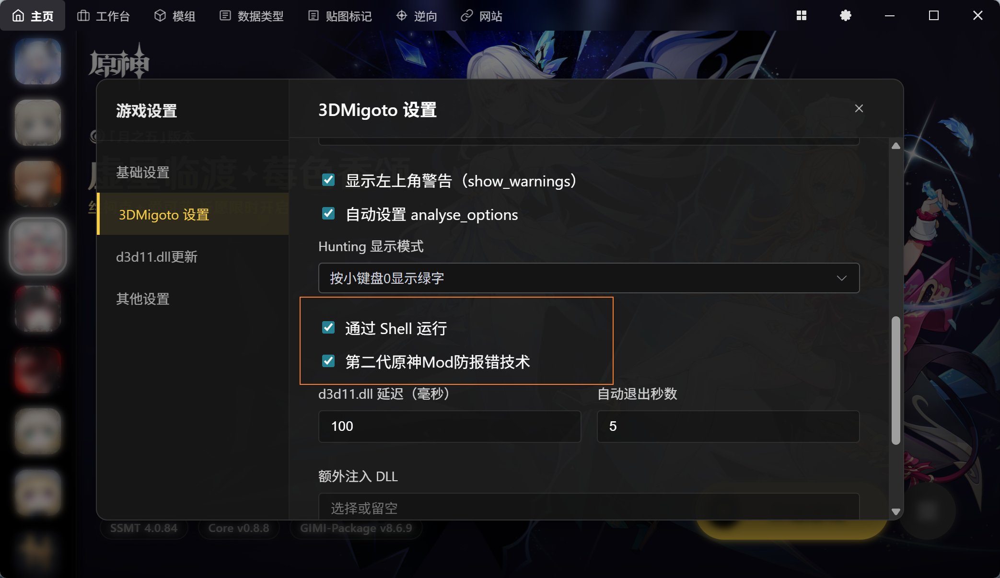

# SSMT4如何解决10612-4001等报错

最近一次更新日期:2026-04-05 07:50

目前完美解决报错，可危战，可千星。

## 解决方案

1.开启Shell启动，开启第二代防报错技术

2.开启第五代防报错技术

> 由于公开会导致很快失效，仅提供LTS技术支持群友使用，可在如下赞助链接中获取，
> 之前激活过的无需重复激活，下载最新版SSMT4直接使用即可
> 
> https://afdian.com/item/ec74ee782b2f11efb5a052540025c377

## 核心原理

由于机制一旦公开，原神那边就会立刻更新来补上，部分同类工具也会直接照抄导致大范围传播后失效，
所以部分特殊电脑环境，如果按照上述操作仍然无法解决报错问题的话，在LTS群内的兄弟们，直接联系我1对1 QQ远程桌面即可，我直接用隐藏技巧帮你配置好。

