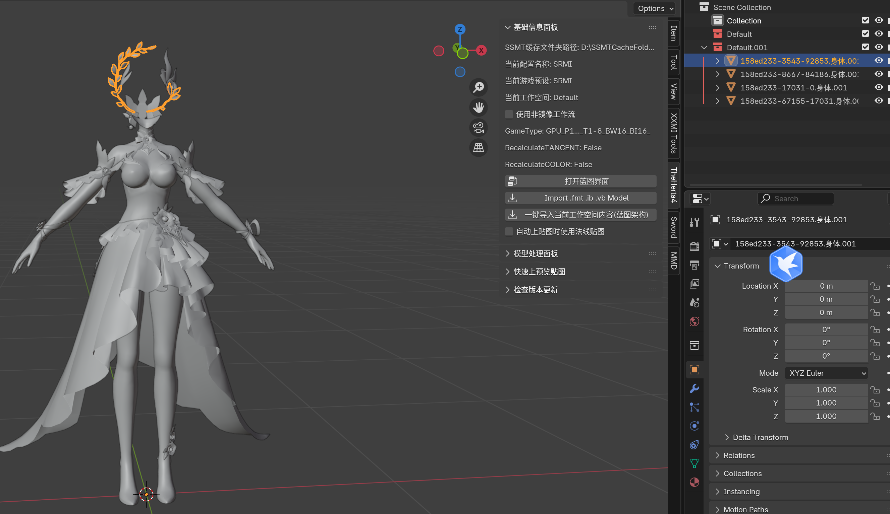
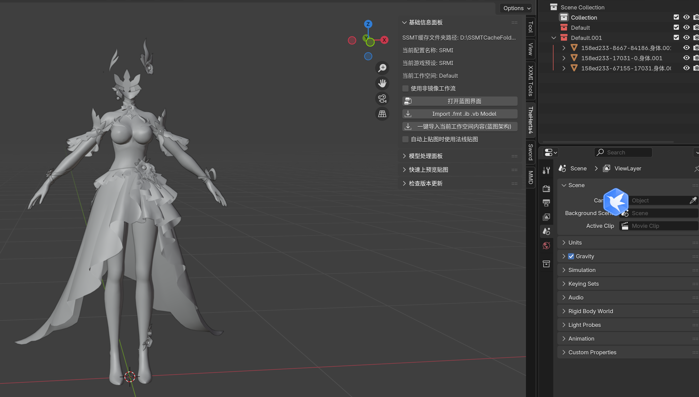
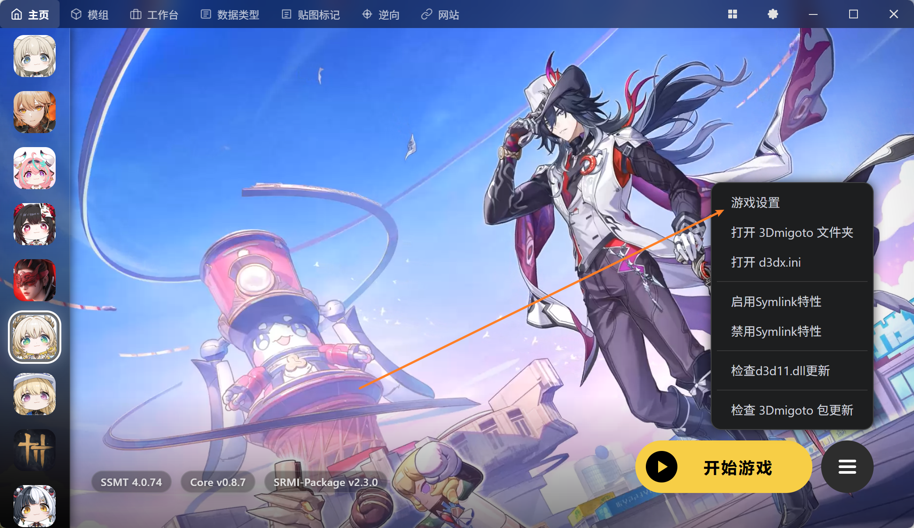
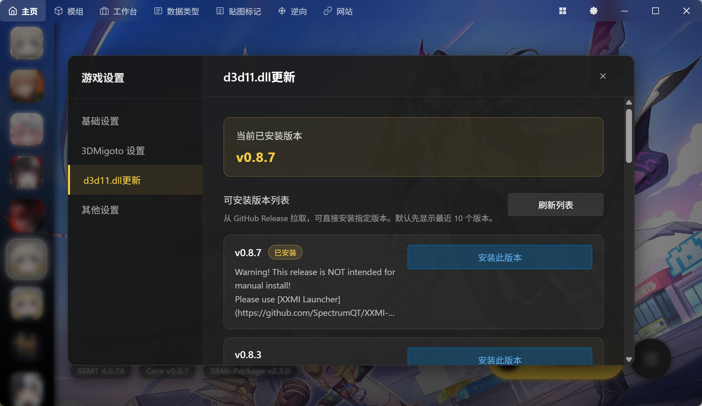
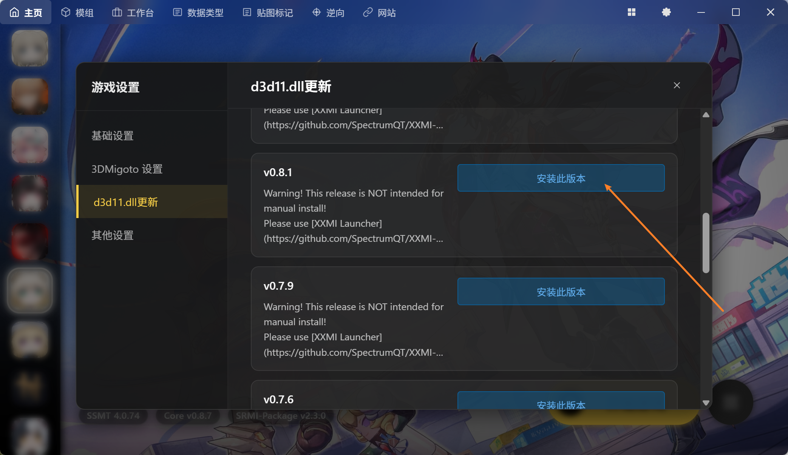
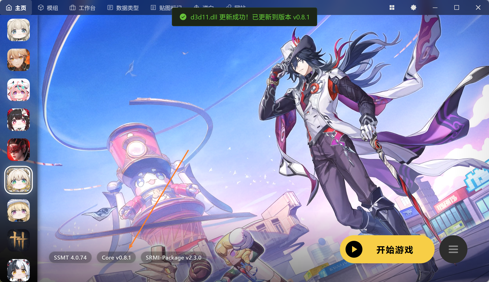

# 为什么崩铁更新后，无法Dump完整身体了？

目前崩铁更新后，F8 Dump需要一个非常严格的条件：

> 1.确保ShaderFixes和Mods文件夹下面的内容都被清空，或者全部DISABLED掉，然后游戏里F10刷新，否则会导致Dump结果错误，出现炸模型问题

> 2.小键盘7和8选择IB时，会破坏Buffer的内容，需要在选择完IB之后，切换到其它角色，再切换回来，即刷新缓存，然后打开绿字直接Dump，才能正确Dump出来全部部件，否则会随机丢失一个IB部件

例如昔涟的头环叶子：

如果不遵守第二条的话，就会导致这个头环部位丢失，提取出来就是下面这样的：

这个问题在崩铁最近的更新后就出现了，所以需要特别注意（Mod门槛又又又增加了）

> 3.经过部分用户测试，使用旧版本的SSMT3是可以正常Dump出来完整部件的，我推测这可能是由于d3d11.dll的BUG导致的，SpectrumQT最近更新了对于终末地Mod特殊支持的d3d11.dll版本之后，就开始出现崩铁无法Dump完整的问题

针对此问题，在SSMT v4.0.74中，新增了一个功能可以将你的d3d11.dll恢复到旧版本，首先我们点开游戏设置：

然后切换到d3d11.dll更新分类：

下滑找到更久远的版本，例如v0.8.1，点击安装此版本：

随后可以看到，我们的d3d11.dll版本就恢复为v0.8.1了：

此时我们再回去游戏里Dump并提取，发现按照 步骤1，2 卸载所有Mod后，每次都能成功提取出完整的身体部件了。

