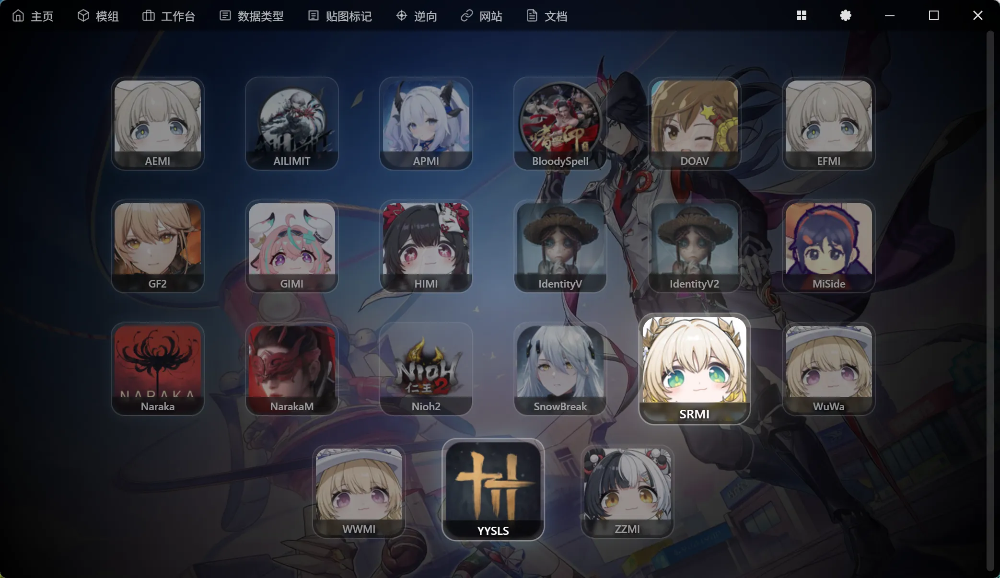
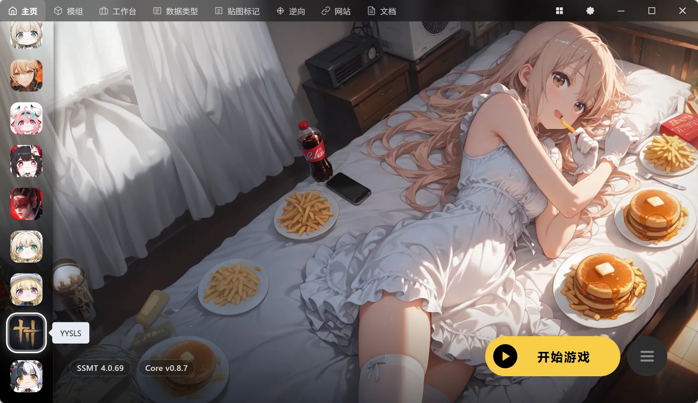
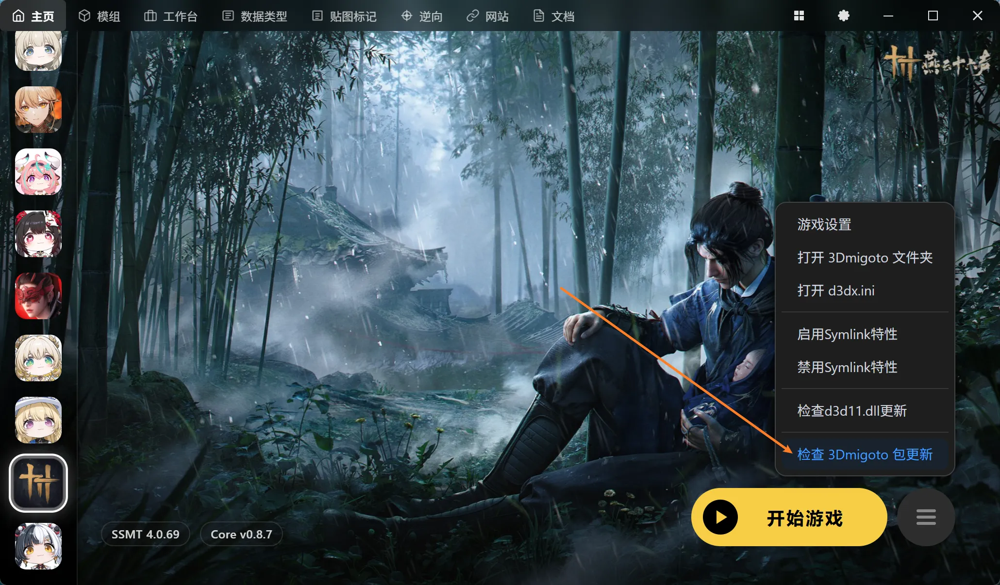
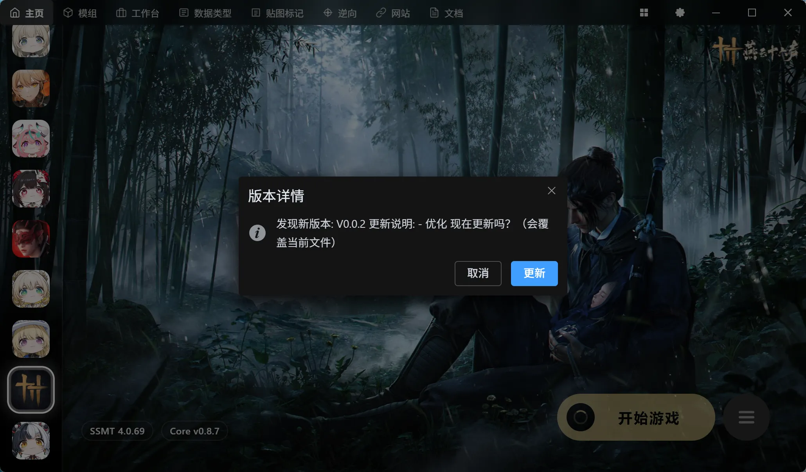

# 如何配置燕云十六声

这游戏玩的人比较少，所以目前只支持了30%左右，遇到问题记得反馈给我，我有空会去测试。

##  添加游戏到主页 
首先切换到游戏库页面，点击YYSLS的图标

YYSLS就是燕云十六声的拼音首字母简写大写

点击后会切换到该游戏，随后右键添加到收藏

就会将此游戏添加到主页左侧常用列表，并跳转回主页：

## 顺手设置个背景图（仪式感）

## 检查包更新

目前SSMT对YYSLS的支持，仍然处于内测阶段，所以使用的是MinBase-Package以及手动Check

## 路径设置注意事项

YYSLS的路径填写和其他游戏不一样，需要特别注意

