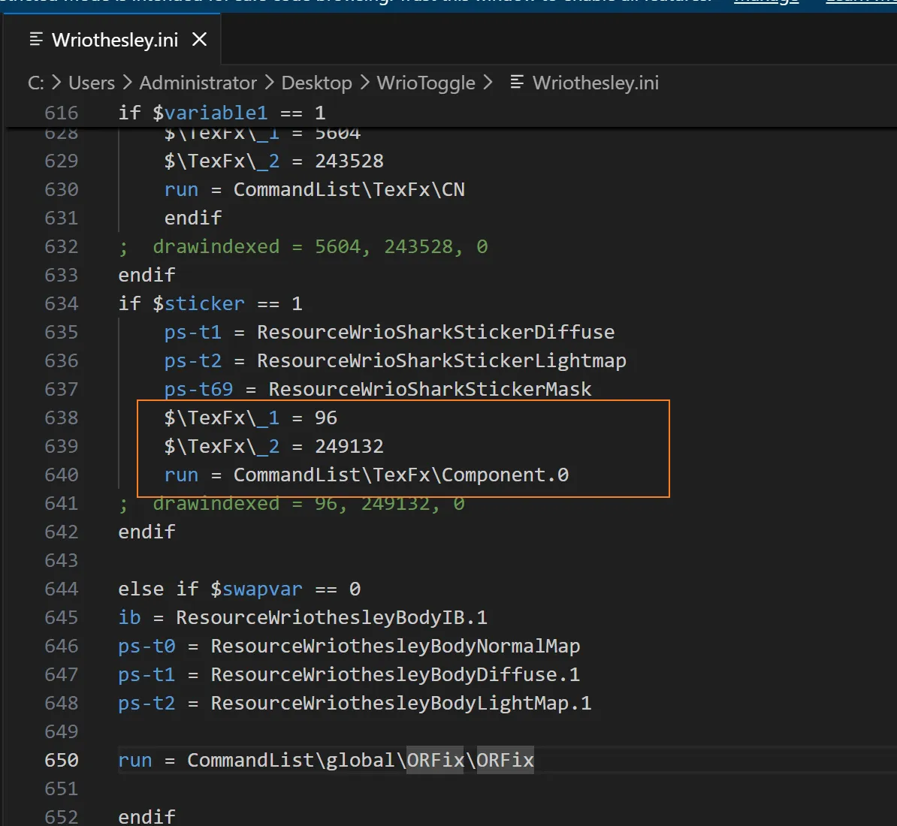

# 案例：调用TexFx进行绘制的Mod

## 问题描述

有一些Mod使用了TexFx插件进行绘制透明部位，此时一键逆向无法解析：

## 解决方案1: 修改ini文件

第一种方法是修改`.ini`文件，例如这里的`$\TexFx\_1`是Offset, `$\TexFx\_2`是IndexCount

所以可以改写为DrawIndexed，例如 `drawindexed = 249132, 96, 0`

从而使自动逆向能够解析，从而逆向出来Mod

## 解决方案2: 手动逆向 + 手动分割

第二种方法是使用手动逆向，直接绕过自动解析的限制，最后看ini这俩爹IndexCount和Offset

再使用TheHerta插件的Split By DrawIndexed功能进行分割分块儿

