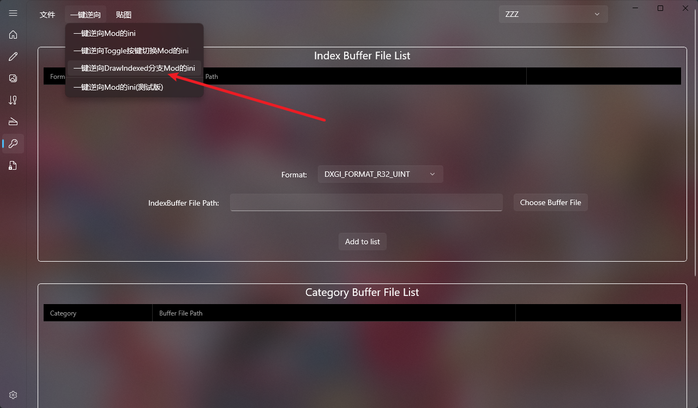
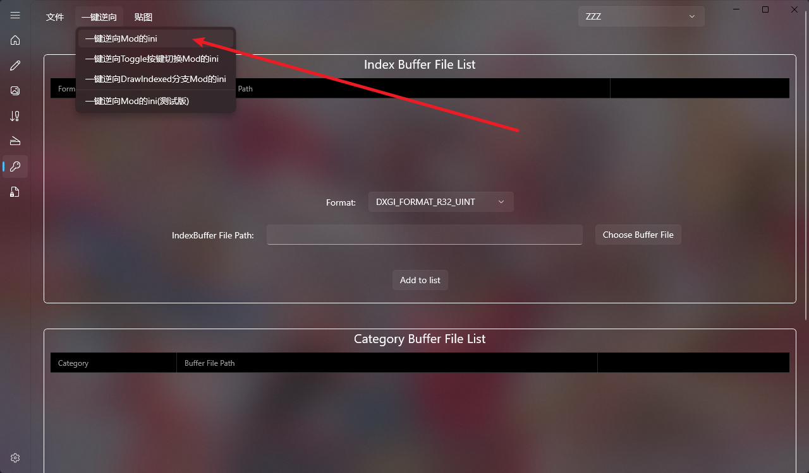

（如果你嫌弃下面的教程麻烦，直接用我们最强的手动逆向功能，即可解决这个问题。）

视频教程（已经很老了，仅供流程参考）：

https://www.bilibili.com/video/BV1fD6oYiEqH/?spm_id_from=333.1387.upload.video_card.click

ZZZ中经常用到跨IB渲染技术，Mod案例ini如下：

```
; Made by KanouSakura
; 本mod由狩野樱制作 

; My sponsorship method:
; 我的赞助方式：
; https://www.patreon.com/KanouSakura
; https://afdian.com/a/baka5

; thanks for your support!
; 感谢您的支持！

; Constants -------------------------

[Constants]
global $active = 0
global $creditinfo = 0

global persist $Coat = 0
global persist $Badge = 0
global persist $Shoes = 0
global persist $Tachi = 0
global persist $Back1 = 0
global persist $Skirt = 0

[KeyCoat]
condition = $active == 0
key = VK_UP
type = cycle
$Coat = 0,1

[KeyBadge]
condition = $active == 0
key = VK_UP
type = cycle
$Badge = 0,1

[KeyShoes]
condition = $active == 0
key = VK_DOWN
type = cycle
$Shoes = 0,1

[KeyTachi]
condition = $active == 0
key = VK_LEFT
type = cycle
$Tachi = 0,1

[KeyBack1]
condition = $active == 0
key = VK_RIGHT
type = cycle
$Back1 = 0,1

[KeySkirt]
condition = $active == 0
key = VK_RIGHT
type = cycle
$Skirt = 0,1
[Present]
post $active = 0

; Overrides -------------------------

[TextureOverrideMiyabiHairBlend]
hash = 8b2eeb77
handling = skip
vb2 = ResourceMiyabiHairBlend
if DRAW_TYPE == 1
	vb0 = ResourceMiyabiHairPosition
	draw = 7045,0
endif

[TextureOverrideMiyabiHairTexcoord]
hash = b6530b86
vb1 = ResourceMiyabiHairTexcoord

[TextureOverrideMiyabiHairVertexLimitRaise]
hash = 5a8d28f4

[TextureOverrideMiyabiBodyBlend]
hash = 9a4227c8
handling = skip
vb2 = ResourceMiyabiBodyBlend
if DRAW_TYPE == 1
	vb0 = ResourceMiyabiBodyPosition
	draw = 51178,0
endif

[TextureOverrideMiyabiBodyTexcoord]
hash = 303fb1b6
vb1 = ResourceMiyabiBodyTexcoord

[TextureOverrideMiyabiBodyVertexLimitRaise]
hash = 6201dd9e

[TextureOverrideMiyabiLegsBlend]
hash = bc586fd9
handling = skip
vb2 = ResourceMiyabiLegsBlend
if DRAW_TYPE == 1
	vb0 = ResourceMiyabiLegsPosition
	draw = 41745,0
endif

[TextureOverrideMiyabiLegsTexcoord]
hash = fb94d66c
vb1 = ResourceMiyabiLegsTexcoord

[TextureOverrideMiyabiLegsVertexLimitRaise]
hash = 8336ded4

[TextureOverrideMiyabiHairIB]
hash = 4faabaac
handling = skip
drawindexed = auto

[TextureOverrideMiyabiHairA]
hash = 4faabaac
match_first_index = 0
run = CommandListSkinTexture
ib = ResourceMiyabiHairAIB
ps-t4 = ResourceMiyabiHairANormalMap

[TextureOverrideMiyabiHairADiffuse]
hash = 012e84e9
this = ResourceMiyabiHairADiffuse

[TextureOverrideMiyabi.HairA.Diffuse.1024]
hash = ed6b94f7
this = ResourceMiyabiHairADiffuse

[TextureOverrideMiyabiHairANormalMap]
hash = 4e91d830
this = ResourceMiyabiHairANormalMap

[TextureOverrideMiyabiHairALightMap]
hash = a6ea6d83
this = ResourceMiyabiHairALightMap

[TextureOverrideMiyabi.HairA.LightMap.1024]
hash = 8b5708f4
this = ResourceMiyabiHairALightMap

[TextureOverrideMiyabiHairAMaterialMap]
hash = d5462e37
this = ResourceMiyabiHairAMaterialMap

[TextureOverrideMiyabi.HairA.MaterialMap.1024]
hash = a84d9003
this = ResourceMiyabiHairAMaterialMap

[TextureOverrideMiyabiHairB]
hash = 4faabaac
match_first_index = 15132
run = CommandListSkinTexture
ib = ResourceMiyabiHairBIB
ps-t4 = ResourceMiyabiHairANormalMap

[TextureOverrideMiyabiBodyIB]
hash = 981c1a1e
handling = skip

[ResourceBodyVB]
[TextureOverrideMiyabiBodyA]
hash = 981c1a1e
match_first_index = 0
ResourceBodyVB = copy vb0
run = CommandListSkinTexture
ib = ResourceMiyabiBodyAIB
ps-t4 = ResourceMiyabiBodyANormalMap
; MiyabiBodyA
	; Belt腰带 (1849)
	; drawindexed = 6042, 42057, 0
	; MiyabiBodyA (3518)
	drawindexed = 15510, 143442, 0
	; Rope绳子 (4615)
	drawindexed = 22518, 158952, 0
	; Skirt Back后裙 (431)
	drawindexed = 2169, 191706, 0	
	; hairC (1193)
	drawindexed = 4038, 215736, 0
	; Skirt Back1后裙1 (1872)
	if $Back1 == 0
	drawindexed = 10236, 181470, 0
	endif
	; Skirt Front前裙 (754)
	if $Skirt == 0
	drawindexed = 3552, 193875, 0
	endif
	; Tachi太刀 (4581)
	if $Tachi == 0
	drawindexed = 18309, 197427, 0	
	endif
	; Coat大衣 (24067)
	if $Coat == 0
	drawindexed = 95343, 48099, 0
	endif
ib = ResourceMiyabiBodyAIB
vb0 = ResourceBodyVB
vb1 = ResourceMiyabiBodyTexcoord
drawindexed = 26547, 15510, 0

[TextureOverrideMiyabiBodyADiffuse]
hash = 09a2bbd1
this = ResourceMiyabiBodyADiffuse

[TextureOverrideMiyabi.BodyA.Diffuse.1024]
hash = 1a3644e7
this = ResourceMiyabiBodyADiffuse

[TextureOverrideMiyabiBodyANormalMap]
hash = f218beff
this = ResourceMiyabiBodyANormalMap

[TextureOverrideMiyabiBodyALightMap]
hash = fd289380
this = ResourceMiyabiBodyALightMap

[TextureOverrideMiyabi.BodyA.LightMap.1024]
hash = 0492f64a
this = ResourceMiyabiBodyALightMap

[TextureOverrideMiyabiBodyAMaterialMap]
hash = 450770fd
this = ResourceMiyabiBodyAMaterialMap

[TextureOverrideMiyabi.BodyA.MaterialMap.1024]
hash = 168b1df9
this = ResourceMiyabiBodyAMaterialMap

[TextureOverrideMiyabiLegsIB]
hash = d8003df3
handling = skip

[TextureOverrideMiyabiLegsA]
hash = d8003df3
match_first_index = 0
run = CommandListSkinTexture
ib = ResourceMiyabiLegsAIB
ps-t4 = ResourceMiyabiHairANormalMap
; MiyabiLegsA
	; Arm手臂 (2595)
	; drawindexed = 10209, 92352, 0
	; MiyabiLegsA (17862)
	run = CustomShaderTransparency
	; Shoes鞋子 (3376)
	if $Shoes == 0
	drawindexed = 13680, 195045, 0
	endif
	; Badge胸牌 (50)
	if $Badge == 0
	drawindexed = 132, 102561, 0
	endif


[TextureOverrideMiyabiFaceAIB]
hash = dbd59d30
run = CommandListSkinTexture

[TextureOverrideMiyabiFaceADiffuse]
hash = 1d487fd5
this = ResourceMiyabiFaceADiffuse

[TextureOverrideMiyabi.FaceA.Diffuse.1024]
hash = 92599e94
this = ResourceMiyabiFaceADiffuse

[TextureOverrideTextureaaa]
hash = 02e62d7e
match_priority = 0
ps-t3 = ResourceTextureaaaa

[TextureOverridewq1A]
hash = 1a82a439
match_first_index = 0
run = CommandListSkinTexture

[TextureOverridewq2A]
hash = 562b2030
match_first_index = 0
run = CommandListSkinTexture

[TextureOverridewq1ADiffuse]
hash = 718d7915
this = Resourcewq1ADiffuse


; CommandList -----------------------

; Resources -------------------------

[ResourceMiyabiHairPosition]
type = Buffer
stride = 40
filename = MiyabiHairPosition.buf

[ResourceMiyabiHairBlend]
type = Buffer
stride = 32
filename = MiyabiHairBlend.buf

[ResourceMiyabiHairTexcoord]
type = Buffer
stride = 20
filename = MiyabiHairTexcoord.buf

[ResourceMiyabiBodyPosition]
type = Buffer
stride = 40
filename = MiyabiBodyPosition.buf

[ResourceMiyabiBodyBlend]
type = Buffer
stride = 32
filename = MiyabiBodyBlend.buf

[ResourceMiyabiBodyTexcoord]
type = Buffer
stride = 20
filename = MiyabiBodyTexcoord.buf

[ResourceMiyabiLegsPosition]
type = Buffer
stride = 40
filename = MiyabiLegsPosition.buf

[ResourceMiyabiLegsBlend]
type = Buffer
stride = 32
filename = MiyabiLegsBlend.buf

[ResourceMiyabiLegsTexcoord]
type = Buffer
stride = 20
filename = MiyabiLegsTexcoord.buf

[ResourceMiyabiHairAIB]
type = Buffer
format = DXGI_FORMAT_R32_UINT
filename = MiyabiHairA.ib

[ResourceMiyabiHairBIB]
type = Buffer
format = DXGI_FORMAT_R32_UINT
filename = MiyabiHairB.ib

[ResourceMiyabiBodyAIB]
type = Buffer
format = DXGI_FORMAT_R32_UINT
filename = MiyabiBodyA.ib

[ResourceMiyabiLegsAIB]
type = Buffer
format = DXGI_FORMAT_R32_UINT
filename = MiyabiLegsA.ib

[CustomShaderTransparency]
blend = ADD BLEND_FACTOR INV_BLEND_FACTOR
blend_factor[0] = 1
blend_factor[1] = 1
blend_factor[2] = 1
blend_factor[3] = 1
drawindexed = 92352, 102693, 0

[ResourceMiyabiHairADiffuse]
filename = MiyabiHairADiffuse.dds

[ResourceMiyabiHairALightMap]
filename = MiyabiHairALightMap.dds

[ResourceMiyabiHairAMaterialMap]
filename = MiyabiHairAMaterialMap.dds

[ResourceMiyabiBodyADiffuse]
filename = MiyabiBodyADiffuse.dds

[ResourceMiyabiBodyALightMap]
filename = MiyabiBodyALightMap.dds

[ResourceMiyabiBodyAMaterialMap]
filename = MiyabiBodyAMaterialMap.dds

[ResourceMiyabiFaceADiffuse]
filename = MiyabiFaceADiffuse.dds

[ResourceMiyabiHairANormalMap]
filename = MiyabiHairANormalMap.dds

[ResourceMiyabiBodyANormalMap]
filename = MiyabiBodyANormalMap.dds

[ResourceTextureaaaa]
filename = ADiffuse.dds

[Resourcewq1ADiffuse]
filename = BDiffuse.dds

; .ini generated by XXMI (XX-Model-Importer)
; If you have any issues or find any bugs, please open a ticket at https://github.com/leotorrez/XXMI-Tools/issues

```
你需要把Mod的跨IB渲染部分还原回去，得到如下结果：

```
; Made by KanouSakura
; 本mod由狩野樱制作 

; My sponsorship method:
; 我的赞助方式：
; https://www.patreon.com/KanouSakura
; https://afdian.com/a/baka5

; thanks for your support!
; 感谢您的支持！

; Constants -------------------------

[Constants]
global $active = 0
global $creditinfo = 0

global persist $Coat = 0
global persist $Badge = 0
global persist $Shoes = 0
global persist $Tachi = 0
global persist $Back1 = 0
global persist $Skirt = 0

[KeyCoat]
condition = $active == 0
key = VK_UP
type = cycle
$Coat = 0,1

[KeyBadge]
condition = $active == 0
key = VK_UP
type = cycle
$Badge = 0,1

[KeyShoes]
condition = $active == 0
key = VK_DOWN
type = cycle
$Shoes = 0,1

[KeyTachi]
condition = $active == 0
key = VK_LEFT
type = cycle
$Tachi = 0,1

[KeyBack1]
condition = $active == 0
key = VK_RIGHT
type = cycle
$Back1 = 0,1

[KeySkirt]
condition = $active == 0
key = VK_RIGHT
type = cycle
$Skirt = 0,1
[Present]
post $active = 0

; Overrides -------------------------

[TextureOverrideMiyabiHairBlend]
hash = 8b2eeb77
handling = skip
vb2 = ResourceMiyabiHairBlend
if DRAW_TYPE == 1
	vb0 = ResourceMiyabiHairPosition
	draw = 7045,0
endif

[TextureOverrideMiyabiHairTexcoord]
hash = b6530b86
vb1 = ResourceMiyabiHairTexcoord

[TextureOverrideMiyabiHairVertexLimitRaise]
hash = 5a8d28f4

[TextureOverrideMiyabiBodyBlend]
hash = 9a4227c8
handling = skip
vb2 = ResourceMiyabiBodyBlend
if DRAW_TYPE == 1
	vb0 = ResourceMiyabiBodyPosition
	draw = 51178,0
endif

[TextureOverrideMiyabiBodyTexcoord]
hash = 303fb1b6
vb1 = ResourceMiyabiBodyTexcoord

[TextureOverrideMiyabiBodyVertexLimitRaise]
hash = 6201dd9e

[TextureOverrideMiyabiLegsBlend]
hash = bc586fd9
handling = skip
vb2 = ResourceMiyabiLegsBlend
if DRAW_TYPE == 1
	vb0 = ResourceMiyabiLegsPosition
	draw = 41745,0
endif

[TextureOverrideMiyabiLegsTexcoord]
hash = fb94d66c
vb1 = ResourceMiyabiLegsTexcoord

[TextureOverrideMiyabiLegsVertexLimitRaise]
hash = 8336ded4

[TextureOverrideMiyabiHairIB]
hash = 4faabaac
handling = skip
drawindexed = auto

[TextureOverrideMiyabiHairA]
hash = 4faabaac
match_first_index = 0
run = CommandListSkinTexture
ib = ResourceMiyabiHairAIB
ps-t4 = ResourceMiyabiHairANormalMap

[TextureOverrideMiyabiHairADiffuse]
hash = 012e84e9
this = ResourceMiyabiHairADiffuse

[TextureOverrideMiyabi.HairA.Diffuse.1024]
hash = ed6b94f7
this = ResourceMiyabiHairADiffuse

[TextureOverrideMiyabiHairANormalMap]
hash = 4e91d830
this = ResourceMiyabiHairANormalMap

[TextureOverrideMiyabiHairALightMap]
hash = a6ea6d83
this = ResourceMiyabiHairALightMap

[TextureOverrideMiyabi.HairA.LightMap.1024]
hash = 8b5708f4
this = ResourceMiyabiHairALightMap

[TextureOverrideMiyabiHairAMaterialMap]
hash = d5462e37
this = ResourceMiyabiHairAMaterialMap

[TextureOverrideMiyabi.HairA.MaterialMap.1024]
hash = a84d9003
this = ResourceMiyabiHairAMaterialMap

[TextureOverrideMiyabiHairB]
hash = 4faabaac
match_first_index = 15132
run = CommandListSkinTexture
ib = ResourceMiyabiHairBIB
ps-t4 = ResourceMiyabiHairANormalMap

[TextureOverrideMiyabiBodyIB]
hash = 981c1a1e
handling = skip

[ResourceBodyVB]
[TextureOverrideMiyabiBodyA]
hash = 981c1a1e
match_first_index = 0
ResourceBodyVB = copy vb0
run = CommandListSkinTexture
ib = ResourceMiyabiBodyAIB
ps-t4 = ResourceMiyabiBodyANormalMap
; MiyabiBodyA
	; Belt腰带 (1849)
	; drawindexed = 6042, 42057, 0
	; MiyabiBodyA (3518)
	drawindexed = 15510, 143442, 0
	; Rope绳子 (4615)
	drawindexed = 22518, 158952, 0
	; Skirt Back后裙 (431)
	drawindexed = 2169, 191706, 0	
	; hairC (1193)
	drawindexed = 4038, 215736, 0
	; Skirt Back1后裙1 (1872)
	if $Back1 == 0
	drawindexed = 10236, 181470, 0
	endif
	; Skirt Front前裙 (754)
	if $Skirt == 0
	drawindexed = 3552, 193875, 0
	endif
	; Tachi太刀 (4581)
	if $Tachi == 0
	drawindexed = 18309, 197427, 0	
	endif
	; Coat大衣 (24067)
	if $Coat == 0
	drawindexed = 95343, 48099, 0
	endif
ib = ResourceMiyabiBodyAIB
vb0 = ResourceBodyVB
vb1 = ResourceMiyabiBodyTexcoord
drawindexed = 26547, 15510, 0

[TextureOverrideMiyabiBodyADiffuse]
hash = 09a2bbd1
this = ResourceMiyabiBodyADiffuse

[TextureOverrideMiyabi.BodyA.Diffuse.1024]
hash = 1a3644e7
this = ResourceMiyabiBodyADiffuse

[TextureOverrideMiyabiBodyANormalMap]
hash = f218beff
this = ResourceMiyabiBodyANormalMap

[TextureOverrideMiyabiBodyALightMap]
hash = fd289380
this = ResourceMiyabiBodyALightMap

[TextureOverrideMiyabi.BodyA.LightMap.1024]
hash = 0492f64a
this = ResourceMiyabiBodyALightMap

[TextureOverrideMiyabiBodyAMaterialMap]
hash = 450770fd
this = ResourceMiyabiBodyAMaterialMap

[TextureOverrideMiyabi.BodyA.MaterialMap.1024]
hash = 168b1df9
this = ResourceMiyabiBodyAMaterialMap

[TextureOverrideMiyabiLegsIB]
hash = d8003df3
handling = skip

[TextureOverrideMiyabiLegsA]
hash = d8003df3
match_first_index = 0
run = CommandListSkinTexture
ib = ResourceMiyabiLegsAIB
ps-t4 = ResourceMiyabiHairANormalMap
; MiyabiLegsA
	; Arm手臂 (2595)
	; drawindexed = 10209, 92352, 0
	; MiyabiLegsA (17862)
	run = CustomShaderTransparency
	; Shoes鞋子 (3376)
	if $Shoes == 0
	drawindexed = 13680, 195045, 0
	endif
	; Badge胸牌 (50)
	if $Badge == 0
	drawindexed = 132, 102561, 0
	endif


[TextureOverrideMiyabiFaceAIB]
hash = dbd59d30
run = CommandListSkinTexture

[TextureOverrideMiyabiFaceADiffuse]
hash = 1d487fd5
this = ResourceMiyabiFaceADiffuse

[TextureOverrideMiyabi.FaceA.Diffuse.1024]
hash = 92599e94
this = ResourceMiyabiFaceADiffuse

[TextureOverrideTextureaaa]
hash = 02e62d7e
match_priority = 0
ps-t3 = ResourceTextureaaaa

[TextureOverridewq1A]
hash = 1a82a439
match_first_index = 0
run = CommandListSkinTexture

[TextureOverridewq2A]
hash = 562b2030
match_first_index = 0
run = CommandListSkinTexture

[TextureOverridewq1ADiffuse]
hash = 718d7915
this = Resourcewq1ADiffuse


; CommandList -----------------------

; Resources -------------------------

[ResourceMiyabiHairPosition]
type = Buffer
stride = 40
filename = MiyabiHairPosition.buf

[ResourceMiyabiHairBlend]
type = Buffer
stride = 32
filename = MiyabiHairBlend.buf

[ResourceMiyabiHairTexcoord]
type = Buffer
stride = 20
filename = MiyabiHairTexcoord.buf

[ResourceMiyabiBodyPosition]
type = Buffer
stride = 40
filename = MiyabiBodyPosition.buf

[ResourceMiyabiBodyBlend]
type = Buffer
stride = 32
filename = MiyabiBodyBlend.buf

[ResourceMiyabiBodyTexcoord]
type = Buffer
stride = 20
filename = MiyabiBodyTexcoord.buf

[ResourceMiyabiLegsPosition]
type = Buffer
stride = 40
filename = MiyabiLegsPosition.buf

[ResourceMiyabiLegsBlend]
type = Buffer
stride = 32
filename = MiyabiLegsBlend.buf

[ResourceMiyabiLegsTexcoord]
type = Buffer
stride = 20
filename = MiyabiLegsTexcoord.buf

[ResourceMiyabiHairAIB]
type = Buffer
format = DXGI_FORMAT_R32_UINT
filename = MiyabiHairA.ib

[ResourceMiyabiHairBIB]
type = Buffer
format = DXGI_FORMAT_R32_UINT
filename = MiyabiHairB.ib

[ResourceMiyabiBodyAIB]
type = Buffer
format = DXGI_FORMAT_R32_UINT
filename = MiyabiBodyA.ib

[ResourceMiyabiLegsAIB]
type = Buffer
format = DXGI_FORMAT_R32_UINT
filename = MiyabiLegsA.ib

[CustomShaderTransparency]
blend = ADD BLEND_FACTOR INV_BLEND_FACTOR
blend_factor[0] = 1
blend_factor[1] = 1
blend_factor[2] = 1
blend_factor[3] = 1
drawindexed = 92352, 102693, 0

[ResourceMiyabiHairADiffuse]
filename = MiyabiHairADiffuse.dds

[ResourceMiyabiHairALightMap]
filename = MiyabiHairALightMap.dds

[ResourceMiyabiHairAMaterialMap]
filename = MiyabiHairAMaterialMap.dds

[ResourceMiyabiBodyADiffuse]
filename = MiyabiBodyADiffuse.dds

[ResourceMiyabiBodyALightMap]
filename = MiyabiBodyALightMap.dds

[ResourceMiyabiBodyAMaterialMap]
filename = MiyabiBodyAMaterialMap.dds

[ResourceMiyabiFaceADiffuse]
filename = MiyabiFaceADiffuse.dds

[ResourceMiyabiHairANormalMap]
filename = MiyabiHairANormalMap.dds

[ResourceMiyabiBodyANormalMap]
filename = MiyabiBodyANormalMap.dds

[ResourceTextureaaaa]
filename = ADiffuse.dds

[Resourcewq1ADiffuse]
filename = BDiffuse.dds

; .ini generated by XXMI (XX-Model-Importer)
; If you have any issues or find any bugs, please open a ticket at https://github.com/leotorrez/XXMI-Tools/issues

```


随后一键逆向DrawIndexed即可：



如果还是缺部位，那就再运行一次一键逆向普通单个Mod的ini



