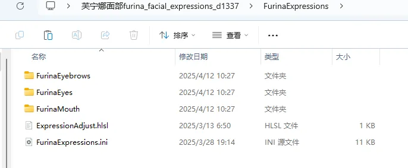
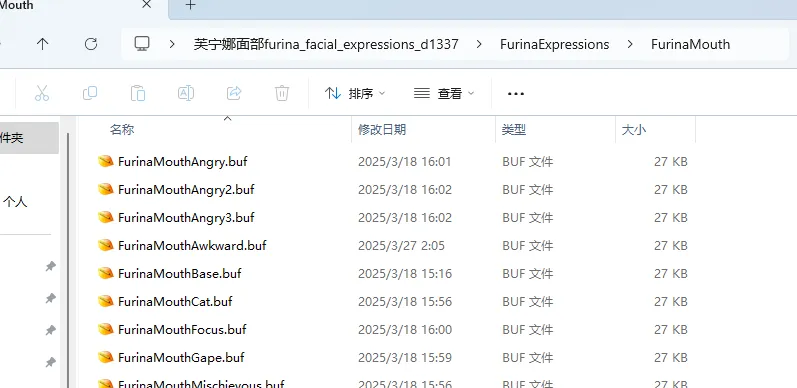
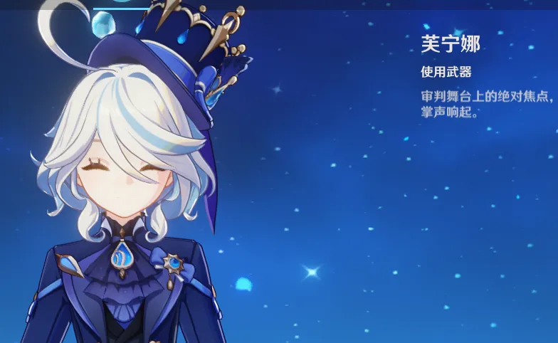

# 🎭 原神脸部逆向教程

首先以一个芙宁娜的 Mod 为例，这是文件结构：





可以看到，这个 Mod 是给芙芙添加了不同的表情，且按键可以切换：



## 🧠 原理分析

原理是使用了 `CustomShader` 通过顶点偏移来模拟表情的形态键：

```hlsl
struct vb0 {
    float3 position; 	// 12
    float3 normal; 		// 24
	float4 tangent;		// 40
};

RWStructuredBuffer<vb0> rw_buffer : register(u1);
StructuredBuffer<vb0> base : register(t0);
StructuredBuffer<vb0> key : register(t1);

Texture1D<float4> IniParams : register(t120);

[numthreads(1, 1, 1)]
void main(uint3 DTid : SV_DispatchThreadID)
{
    rw_buffer[DTid.x].position += key[DTid.x].position - base[DTid.x].position;
}
```

此时所有的 `.buf` 文件都是 `Position` 分类的数据，并且和游戏中原本脸部的 `Position` 数据仅有 `POSITION`、`NORMAL`、`TANGENT` 的位置不同。

## 🛠️ 逆向步骤

1.  **提取原模型**：去游戏里提取脸部三个部位的原模型，以此来获取它们的 `ib` 文件。
2.  **修改 fmt**：改写 `fmt` 文件，仅保留 `POSITION`，`NORMAL`，`TANGENT` 三个元素。
3.  **重命名文件**：Mod 里的 `.buf` 文件改名为 `.vb` 文件。
4.  **组合模型**：用刚才得到的 `.ib` `.fmt` `.vb` 文件放在一起，它就是一个可以被导入到 Blender 中的模型了。


