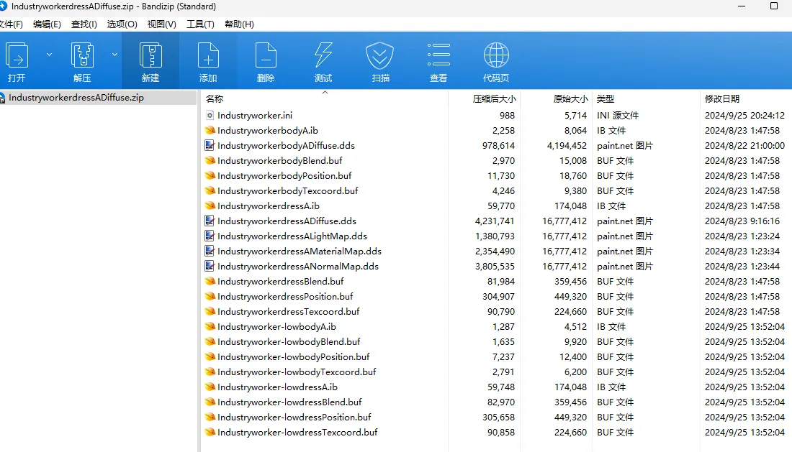
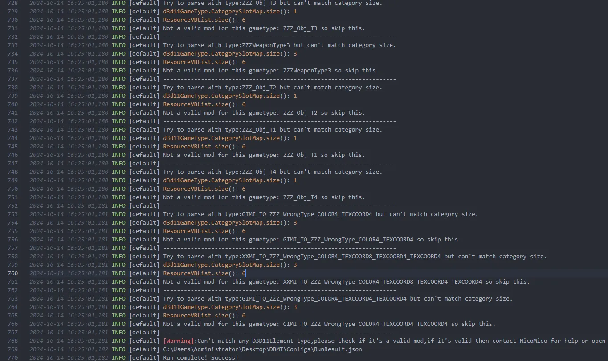
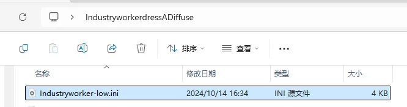
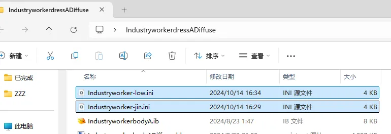
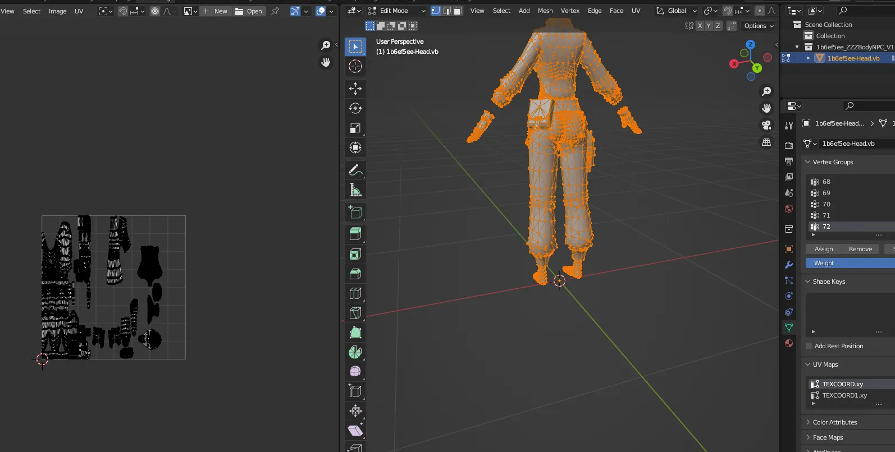

查看Mod文件：



可以看到这个绝区零Mod的远距离是加了low标识的，代表低模的意思，这时候一键逆向发现只有贴图文件而没有模型文件，然后我们去查看日志发现如下：



所有的数据类型都匹配失败了，核心的原因是Resource列表的大小为6，这个正常应该为3，这说明资源列表翻倍了。


由于我们的逆向程序是根据顶点数对资源进行区分的，这时资源列表大小翻倍，说明有两个Hash的Mod使用了同样大小顶点数的Buffer文件，说明是把近距离和远距离写在了一个ini中，所以程序无法自动识别。

这时候需要我们去手动的拆分ini，其核心原理就是把一个整合在一起的ini拆分为两个分离的ini，分别代表远距离和近距离两个Mod的ini。

原始ini内容如下：
```
; Industryworker

; Constants -------------------------

; Overrides -------------------------

;[TextureOverrideIndustryworkerbodyPosition]
;hash = 37930693
;handling = skip
;vb0 = ResourceIndustryworkerbodyPosition
;vb2 = ResourceIndustryworkerbodyBlend
;draw = 469,0

;[TextureOverrideIndustryworkerbodyTexcoord]
;hash = e277bcbf
;vb1 = ResourceIndustryworkerbodyTexcoord

;[TextureOverrideIndustryworkerbodyVertexLimitRaise]
;hash = 5b9e8b18
;match_priority = 2

[TextureOverrideIndustryworkerdressPosition]
hash = 75c94bf2
handling = skip
vb0 = ResourceIndustryworkerdressPosition
vb2 = ResourceIndustryworkerdressBlend
draw = 11233,0

[TextureOverrideIndustryworkerdressTexcoord]
hash = 74ba7d57
vb1 = ResourceIndustryworkerdressTexcoord

[TextureOverrideIndustryworkerdressVertexLimitRaise]
hash = 85302f03

;[TextureOverrideIndustryworkerbodyIB]
;hash = f3968c4d
;handling = skip
;drawindexed = auto

;[TextureOverrideIndustryworkerbodyA]
;hash = f3968c4d
;match_first_index = 0
;run = CommandListSkinTexture
;ib = ResourceIndustryworkerbodyAIB
;ps-t3 = ResourceIndustryworkerbodyADiffuse

[TextureOverrideIndustryworkerdressIB]
hash = 28b78808
handling = skip
drawindexed = auto

[TextureOverrideIndustryworkerdressA]
hash = 28b78808
match_first_index = 0
run = CommandListSkinTexture
ib = ResourceIndustryworkerdressAIB
ps-t3 = ResourceIndustryworkerdressADiffuse
ps-t4 = ResourceIndustryworkerdressANormalMap
ps-t5 = ResourceIndustryworkerdressAMaterialMap
ps-t6 = ResourceIndustryworkerdressALightMap

;[TextureOverrideIndustryworker-lowbodyPosition]
;hash = 879c2402
;handling = skip
;vb0 = ResourceIndustryworker-lowbodyPosition
;vb2 = ResourceIndustryworker-lowbodyBlend
;draw = 310,0

;[TextureOverrideIndustryworker-lowbodyTexcoord]
;hash = 02195f3d
;vb1 = ResourceIndustryworker-lowbodyTexcoord

;[TextureOverrideIndustryworker-lowbodyVertexLimitRaise]
;hash = f9935fa0
;match_priority = 2

[TextureOverrideIndustryworker-lowdressPosition]
hash = 75d732d2
handling = skip
vb0 = ResourceIndustryworker-lowdressPosition
vb2 = ResourceIndustryworker-lowdressBlend
draw = 11233,0

[TextureOverrideIndustryworker-lowdressTexcoord]
hash = 22b7e0cf
vb1 = ResourceIndustryworker-lowdressTexcoord

[TextureOverrideIndustryworker-lowdressVertexLimitRaise]
hash = 008c6ff0

;[TextureOverrideIndustryworker-lowbodyIB]
;hash = 9a37c5b5
;handling = skip
;drawindexed = auto

;[TextureOverrideIndustryworker-lowbodyA]
;hash = 9a37c5b5
;match_first_index = 0
;run = CommandListSkinTexture
;ib = ResourceIndustryworker-lowbodyAIB
;ps-t3 = ResourceIndustryworkerbodyADiffuse

[TextureOverrideIndustryworker-lowdressIB]
hash = 1b6ef5ee
handling = skip
drawindexed = auto

[TextureOverrideIndustryworker-lowdressA]
hash = 1b6ef5ee
match_first_index = 0
run = CommandListSkinTexture
ib = ResourceIndustryworker-lowdressAIB
ps-t3 = ResourceIndustryworkerdressADiffuse
ps-t4 = ResourceIndustryworkerdressANormalMap
ps-t5 = ResourceIndustryworkerdressAMaterialMap
ps-t6 = ResourceIndustryworkerdressALightMap

; CommandList -----------------------

; Resources -------------------------

[ResourceIndustryworkerbodyPosition]
type = Buffer
stride = 40
filename = IndustryworkerbodyPosition.buf

[ResourceIndustryworkerbodyBlend]
type = Buffer
stride = 32
filename = IndustryworkerbodyBlend.buf

[ResourceIndustryworkerbodyTexcoord]
type = Buffer
stride = 20
filename = IndustryworkerbodyTexcoord.buf

[ResourceIndustryworkerdressPosition]
type = Buffer
stride = 40
filename = IndustryworkerdressPosition.buf

[ResourceIndustryworkerdressBlend]
type = Buffer
stride = 32
filename = IndustryworkerdressBlend.buf

[ResourceIndustryworkerdressTexcoord]
type = Buffer
stride = 20
filename = IndustryworkerdressTexcoord.buf

[ResourceIndustryworkerbodyAIB]
type = Buffer
format = DXGI_FORMAT_R32_UINT
filename = IndustryworkerbodyA.ib

[ResourceIndustryworkerdressAIB]
type = Buffer
format = DXGI_FORMAT_R32_UINT
filename = IndustryworkerdressA.ib

[ResourceIndustryworker-lowbodyPosition]
type = Buffer
stride = 40
filename = Industryworker-lowbodyPosition.buf

[ResourceIndustryworker-lowbodyBlend]
type = Buffer
stride = 32
filename = Industryworker-lowbodyBlend.buf

[ResourceIndustryworker-lowbodyTexcoord]
type = Buffer
stride = 20
filename = Industryworker-lowbodyTexcoord.buf

[ResourceIndustryworker-lowdressPosition]
type = Buffer
stride = 40
filename = Industryworker-lowdressPosition.buf

[ResourceIndustryworker-lowdressBlend]
type = Buffer
stride = 32
filename = Industryworker-lowdressBlend.buf

[ResourceIndustryworker-lowdressTexcoord]
type = Buffer
stride = 20
filename = Industryworker-lowdressTexcoord.buf

[ResourceIndustryworker-lowbodyAIB]
type = Buffer
format = DXGI_FORMAT_R32_UINT
filename = Industryworker-lowbodyA.ib

[ResourceIndustryworker-lowdressAIB]
type = Buffer
format = DXGI_FORMAT_R32_UINT
filename = Industryworker-lowdressA.ib

[ResourceIndustryworkerbodyADiffuse]
filename = IndustryworkerbodyADiffuse.dds

[ResourceIndustryworkerdressADiffuse]
filename = IndustryworkerdressADiffuse.dds

[ResourceIndustryworkerdressANormalMap]
filename = IndustryworkerdressANormalMap.dds

[ResourceIndustryworkerdressAMaterialMap]
filename = IndustryworkerdressAMaterialMap.dds

[ResourceIndustryworkerdressALightMap]
filename = IndustryworkerdressALightMap.dds


; .ini generated by XXMI (XX-Model-Importer)
; If you have any issues or find any bugs, please open a ticket at https://github.com/SilentNightSound/GI-Model-Importer/issues or contact SilentNightSound#7430 on discord
```


拆出来的近距离Modini如下：

```
; Industryworker

; Constants -------------------------

; Overrides -------------------------

;[TextureOverrideIndustryworkerbodyPosition]
;hash = 37930693
;handling = skip
;vb0 = ResourceIndustryworkerbodyPosition
;vb2 = ResourceIndustryworkerbodyBlend
;draw = 469,0

;[TextureOverrideIndustryworkerbodyTexcoord]
;hash = e277bcbf
;vb1 = ResourceIndustryworkerbodyTexcoord

;[TextureOverrideIndustryworkerbodyVertexLimitRaise]
;hash = 5b9e8b18
;match_priority = 2

[TextureOverrideIndustryworkerdressPosition]
hash = 75c94bf2
handling = skip
vb0 = ResourceIndustryworkerdressPosition
vb2 = ResourceIndustryworkerdressBlend
draw = 11233,0

[TextureOverrideIndustryworkerdressTexcoord]
hash = 74ba7d57
vb1 = ResourceIndustryworkerdressTexcoord

[TextureOverrideIndustryworkerdressVertexLimitRaise]
hash = 85302f03

;[TextureOverrideIndustryworkerbodyIB]
;hash = f3968c4d
;handling = skip
;drawindexed = auto

;[TextureOverrideIndustryworkerbodyA]
;hash = f3968c4d
;match_first_index = 0
;run = CommandListSkinTexture
;ib = ResourceIndustryworkerbodyAIB
;ps-t3 = ResourceIndustryworkerbodyADiffuse

[TextureOverrideIndustryworkerdressIB]
hash = 28b78808
handling = skip
drawindexed = auto

[TextureOverrideIndustryworkerdressA]
hash = 28b78808
match_first_index = 0
run = CommandListSkinTexture
ib = ResourceIndustryworkerdressAIB
ps-t3 = ResourceIndustryworkerdressADiffuse
ps-t4 = ResourceIndustryworkerdressANormalMap
ps-t5 = ResourceIndustryworkerdressAMaterialMap
ps-t6 = ResourceIndustryworkerdressALightMap

;[TextureOverrideIndustryworker-lowbodyPosition]
;hash = 879c2402
;handling = skip
;vb0 = ResourceIndustryworker-lowbodyPosition
;vb2 = ResourceIndustryworker-lowbodyBlend
;draw = 310,0

;[TextureOverrideIndustryworker-lowbodyTexcoord]
;hash = 02195f3d
;vb1 = ResourceIndustryworker-lowbodyTexcoord

;[TextureOverrideIndustryworker-lowbodyVertexLimitRaise]
;hash = f9935fa0
;match_priority = 2


[ResourceIndustryworkerbodyPosition]
type = Buffer
stride = 40
filename = IndustryworkerbodyPosition.buf

[ResourceIndustryworkerbodyBlend]
type = Buffer
stride = 32
filename = IndustryworkerbodyBlend.buf

[ResourceIndustryworkerbodyTexcoord]
type = Buffer
stride = 20
filename = IndustryworkerbodyTexcoord.buf

[ResourceIndustryworkerdressPosition]
type = Buffer
stride = 40
filename = IndustryworkerdressPosition.buf

[ResourceIndustryworkerdressBlend]
type = Buffer
stride = 32
filename = IndustryworkerdressBlend.buf

[ResourceIndustryworkerdressTexcoord]
type = Buffer
stride = 20
filename = IndustryworkerdressTexcoord.buf

[ResourceIndustryworkerbodyAIB]
type = Buffer
format = DXGI_FORMAT_R32_UINT
filename = IndustryworkerbodyA.ib

[ResourceIndustryworkerdressAIB]
type = Buffer
format = DXGI_FORMAT_R32_UINT
filename = IndustryworkerdressA.ib


[ResourceIndustryworkerbodyADiffuse]
filename = IndustryworkerbodyADiffuse.dds

[ResourceIndustryworkerdressADiffuse]
filename = IndustryworkerdressADiffuse.dds

[ResourceIndustryworkerdressANormalMap]
filename = IndustryworkerdressANormalMap.dds

[ResourceIndustryworkerdressAMaterialMap]
filename = IndustryworkerdressAMaterialMap.dds

[ResourceIndustryworkerdressALightMap]
filename = IndustryworkerdressALightMap.dds


; .ini generated by XXMI (XX-Model-Importer)
; If you have any issues or find any bugs, please open a ticket at https://github.com/SilentNightSound/GI-Model-Importer/issues or contact SilentNightSound#7430 on discord

```


拆出来的远距离Mod ini如下：



```

; Industryworker

; Constants -------------------------

; Overrides -------------------------

;[TextureOverrideIndustryworkerbodyPosition]
;hash = 37930693
;handling = skip
;vb0 = ResourceIndustryworkerbodyPosition
;vb2 = ResourceIndustryworkerbodyBlend
;draw = 469,0

;[TextureOverrideIndustryworkerbodyTexcoord]
;hash = e277bcbf
;vb1 = ResourceIndustryworkerbodyTexcoord

;[TextureOverrideIndustryworkerbodyVertexLimitRaise]
;hash = 5b9e8b18
;match_priority = 2


;[TextureOverrideIndustryworker-lowbodyPosition]
;hash = 879c2402
;handling = skip
;vb0 = ResourceIndustryworker-lowbodyPosition
;vb2 = ResourceIndustryworker-lowbodyBlend
;draw = 310,0

;[TextureOverrideIndustryworker-lowbodyTexcoord]
;hash = 02195f3d
;vb1 = ResourceIndustryworker-lowbodyTexcoord

;[TextureOverrideIndustryworker-lowbodyVertexLimitRaise]
;hash = f9935fa0
;match_priority = 2

[TextureOverrideIndustryworker-lowdressPosition]
hash = 75d732d2
handling = skip
vb0 = ResourceIndustryworker-lowdressPosition
vb2 = ResourceIndustryworker-lowdressBlend
draw = 11233,0

[TextureOverrideIndustryworker-lowdressTexcoord]
hash = 22b7e0cf
vb1 = ResourceIndustryworker-lowdressTexcoord

[TextureOverrideIndustryworker-lowdressVertexLimitRaise]
hash = 008c6ff0

;[TextureOverrideIndustryworker-lowbodyIB]
;hash = 9a37c5b5
;handling = skip
;drawindexed = auto

;[TextureOverrideIndustryworker-lowbodyA]
;hash = 9a37c5b5
;match_first_index = 0
;run = CommandListSkinTexture
;ib = ResourceIndustryworker-lowbodyAIB
;ps-t3 = ResourceIndustryworkerbodyADiffuse

[TextureOverrideIndustryworker-lowdressIB]
hash = 1b6ef5ee
handling = skip
drawindexed = auto

[TextureOverrideIndustryworker-lowdressA]
hash = 1b6ef5ee
match_first_index = 0
run = CommandListSkinTexture
ib = ResourceIndustryworker-lowdressAIB
ps-t3 = ResourceIndustryworkerdressADiffuse
ps-t4 = ResourceIndustryworkerdressANormalMap
ps-t5 = ResourceIndustryworkerdressAMaterialMap
ps-t6 = ResourceIndustryworkerdressALightMap

; CommandList -----------------------

; Resources -------------------------

[ResourceIndustryworker-lowbodyPosition]
type = Buffer
stride = 40
filename = Industryworker-lowbodyPosition.buf

[ResourceIndustryworker-lowbodyBlend]
type = Buffer
stride = 32
filename = Industryworker-lowbodyBlend.buf

[ResourceIndustryworker-lowbodyTexcoord]
type = Buffer
stride = 20
filename = Industryworker-lowbodyTexcoord.buf

[ResourceIndustryworker-lowdressPosition]
type = Buffer
stride = 40
filename = Industryworker-lowdressPosition.buf

[ResourceIndustryworker-lowdressBlend]
type = Buffer
stride = 32
filename = Industryworker-lowdressBlend.buf

[ResourceIndustryworker-lowdressTexcoord]
type = Buffer
stride = 20
filename = Industryworker-lowdressTexcoord.buf

[ResourceIndustryworker-lowbodyAIB]
type = Buffer
format = DXGI_FORMAT_R32_UINT
filename = Industryworker-lowbodyA.ib

[ResourceIndustryworker-lowdressAIB]
type = Buffer
format = DXGI_FORMAT_R32_UINT
filename = Industryworker-lowdressA.ib

[ResourceIndustryworkerbodyADiffuse]
filename = IndustryworkerbodyADiffuse.dds

[ResourceIndustryworkerdressADiffuse]
filename = IndustryworkerdressADiffuse.dds

[ResourceIndustryworkerdressANormalMap]
filename = IndustryworkerdressANormalMap.dds

[ResourceIndustryworkerdressAMaterialMap]
filename = IndustryworkerdressAMaterialMap.dds

[ResourceIndustryworkerdressALightMap]
filename = IndustryworkerdressALightMap.dds


; .ini generated by XXMI (XX-Model-Importer)
; If you have any issues or find any bugs, please open a ticket at https://github.com/SilentNightSound/GI-Model-Importer/issues or contact SilentNightSound#7430 on discord
```

差分完成后得到了两个ini文件：



分别点击一键逆向，就可以导入到Blender里进行查看了，到此逆向成功：



下次再遇到类似的就可以手动进行ini拆分来，再使用一键逆向来进行逆向了。
