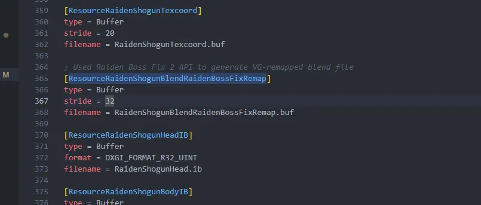
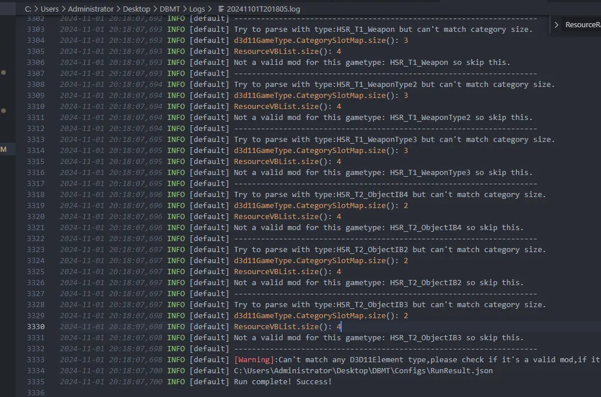
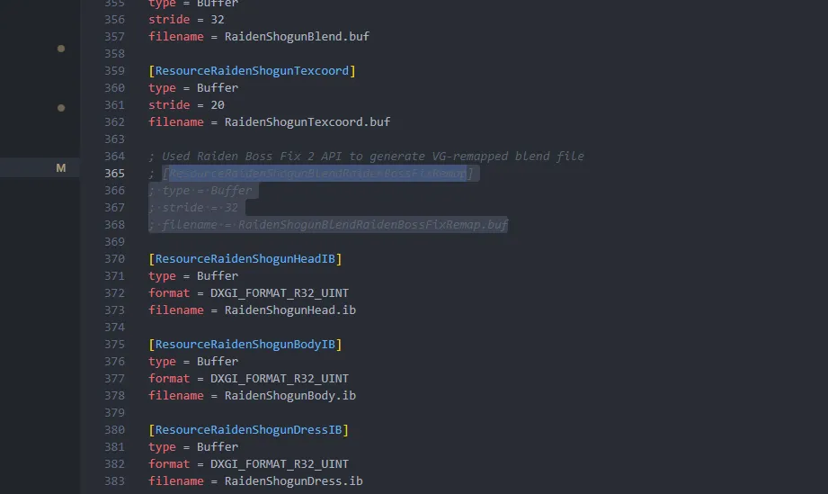
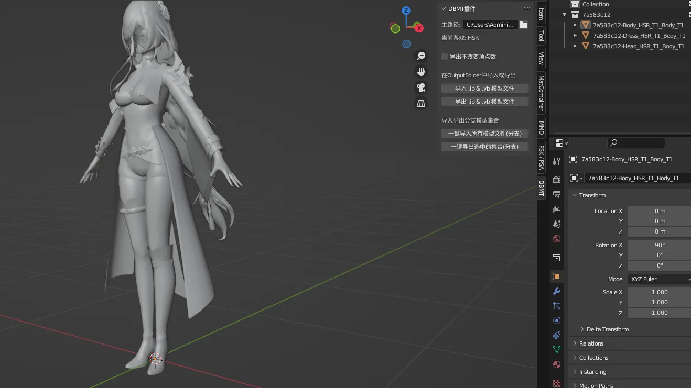

# ⚠️ ResourceVBList.size() 为 4 的 Mod

有些 Mod 额外加入了大招动画修复，或者某些特殊状态下的动画修复，这时候就会多一个 `Blend` 类型的 Resource，技术上称之为 `remapped blend`：

## 🔍 问题分析

直接逆向的话，日志大概是酱紫的：

## 🛠️ 解决方案

这时候我们手动删掉这个 `remapped` 技术的 Resource，或者注释掉：

然后就成功逆向出来了：

