::: warning ⚠️ 版本差异提示
在 **TheHerta3** 版本更新后，`逆向后导入` 和 `自动上贴图` 面板已移动至侧边栏的 **`Sword`** 选项卡中。
本文档截图使用的是旧版本，操作流程基本一致，请根据实际界面进行调整。
:::

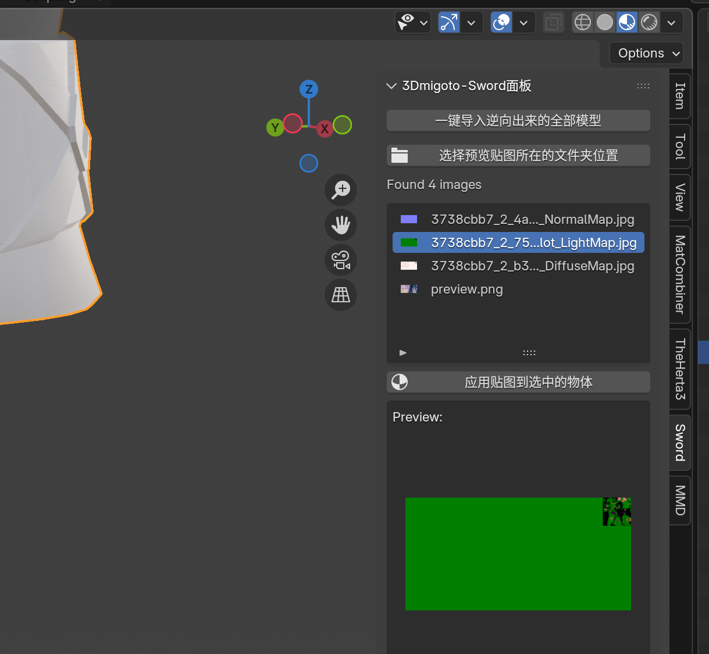

# 🔍 排除并筛选正确的数据类型

::: danger 🚨 遇到的问题
在上一节中，我们在应用贴图后发现显示异常（如下图所示）。
这通常是由于 **❌ 数据类型不正确** 导致的。
:::

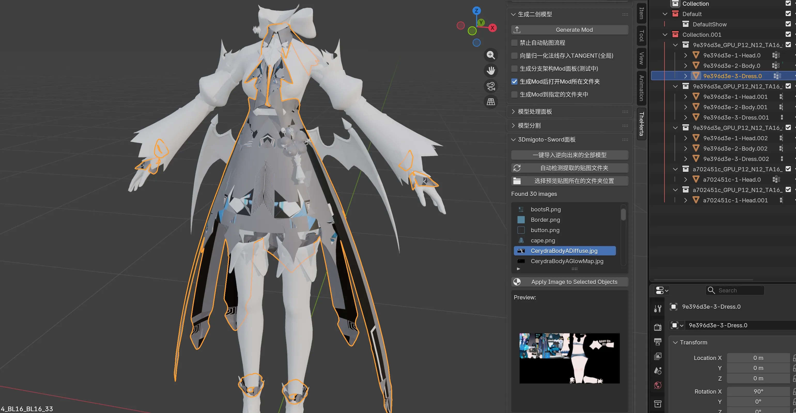

::: info 💡 原理解析：全量逆向策略
Mod 逆向工具会自动分析 Buffer 文件中 **所有可能的数据类型**，并将它们 **全部导出**，以确保没有遗漏。
:::

现在我们回头查看之前逆向生成的文件夹：

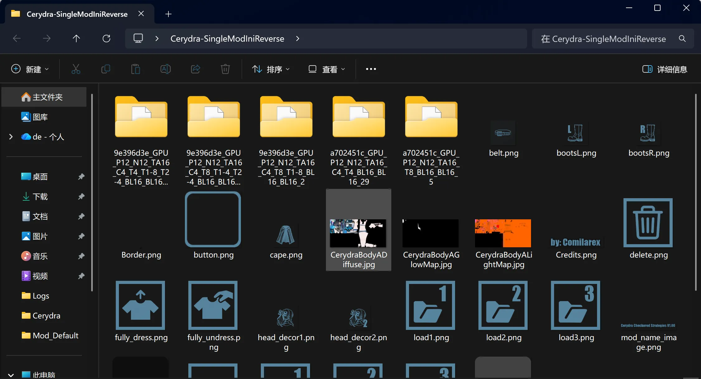

::: tip 📂 文件夹命名规则
每个文件夹的名称由三部分组成：
1.  **`8 位 Hash 值`** (代表模型集合/Collection)
2.  **`_`** (下划线)
3.  **`数据类型名称`**
:::

由于工具分析出了多种可能的数据类型，你会看到多个具有 **相同 Hash 前缀** 但 **后缀不同** 的文件夹。

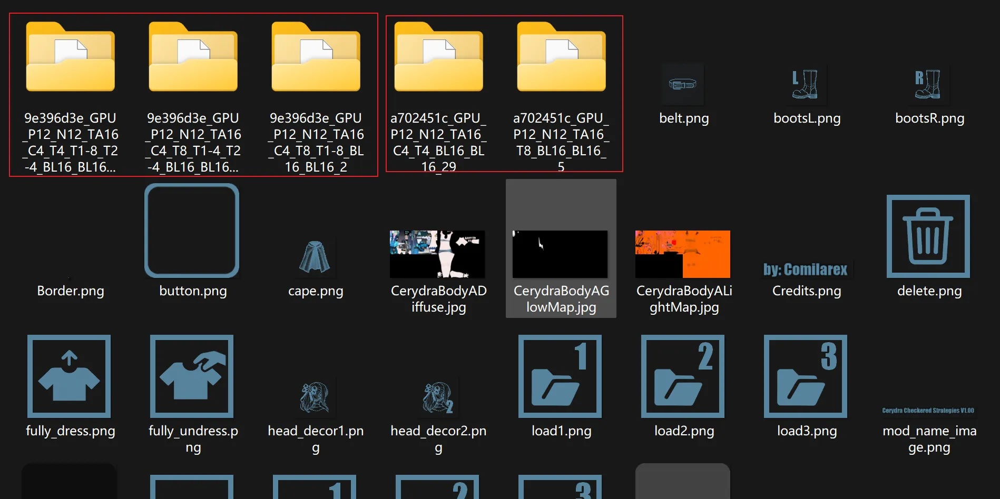

::: warning 🎯 核心目标
在这些选项中，通常 **只有一个数据类型是正确的** ✅。
我们需要 **筛选并保留** 正确的数据类型，**排除** 错误的 ❎。
:::

---

## 🛠️ 筛选步骤详解

首先回到 Blender，查看导入后的集合结构：

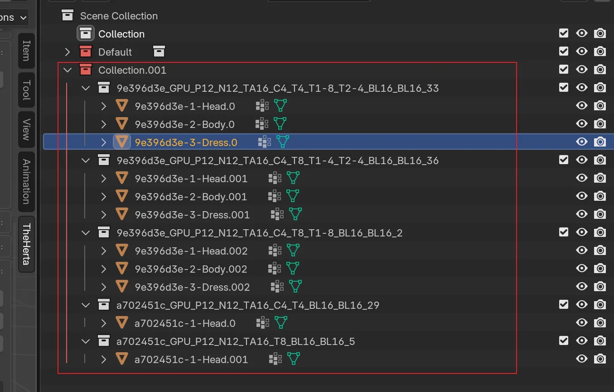

每个白色集合对应一个逆向导出的子文件夹。我们只需删除名称对应错误数据类型的集合，即可排除错误的模型。

### ❓ 如何分辨数据类型是否错误？

回顾刚才贴图错乱的效果，我们可以通过 **检查 UV** 来确认。

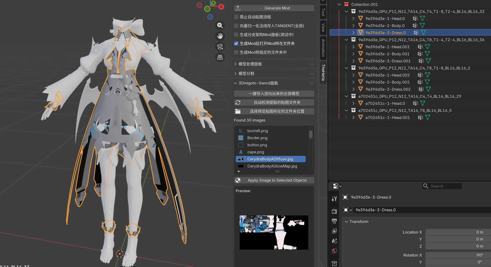

::: tip 👁️ 检查方法
打开 **UV 编辑器** 查看：
:::

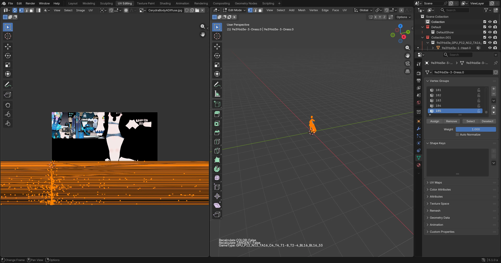

::: danger ❌ 错误特征
可以看到 **UV 映射完全混乱** (炸了)，说明该数据类型是 **错误的**。
我们需要 **删除** 这个错误的集合。
:::

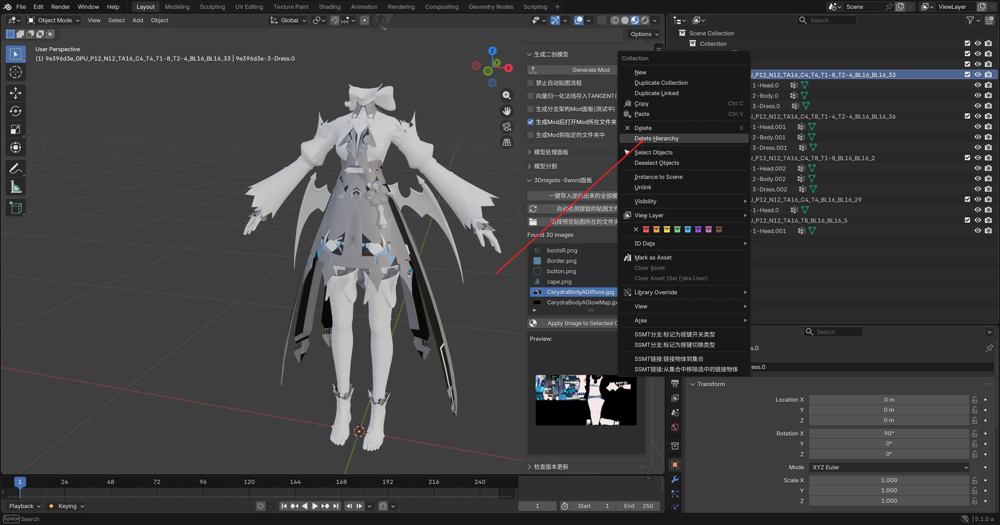

对于 `9e396d3e`，剩余两个候选数据类型。继续检查 UV：

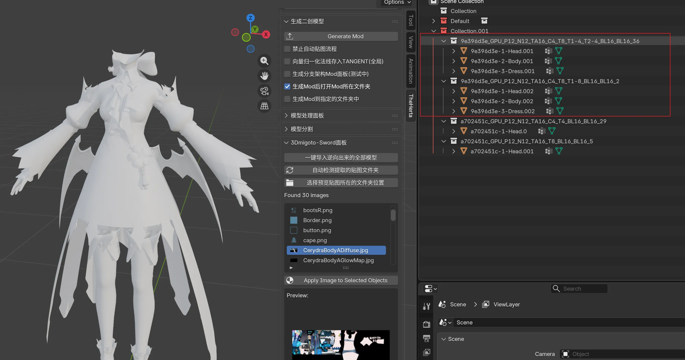

发现其中一个的 **第二套 UV** 是错误的，而另一个的 **所有 UV 均正常**：

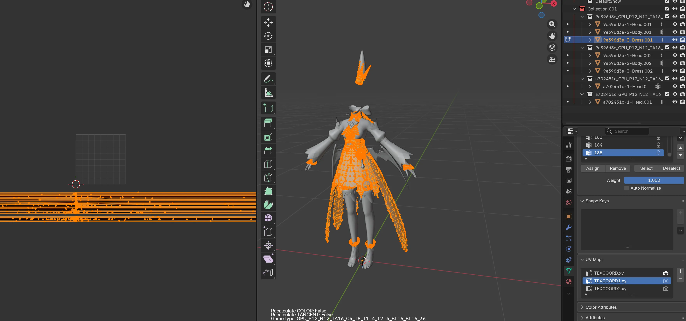

::: tip ✅ 最终筛选
排除错误选项后，保留 **唯一的正确数据类型**：
:::

此时，**自动上贴图** 的结果就正常了 ✨。

对于 `a702451c` 也是同理，删除 UV 错误的那个数据类型。

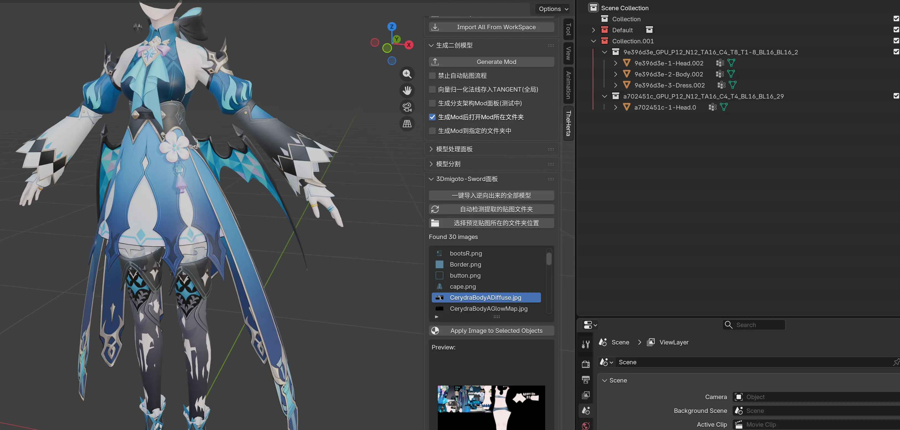

最后得到的结果就可以直接使用了 🎉。

---

## 🚧 重要注意事项：多层 UV 陷阱

::: warning 🧐 为什么只看第一层 UV 不够？
在上述演示中，我们主要通过第一套 UV 进行判断。
但在实际操作中，可能会遇到 **多个数据类型的第一套 UV 看起来都正确且相同** 的情况。
:::

此时，我们需要检查模型的 **其他 UV 层**。

如下图所示，选中模型后，默认显示的第一套 UV 均正常，无法直接区分正确的数据类型。

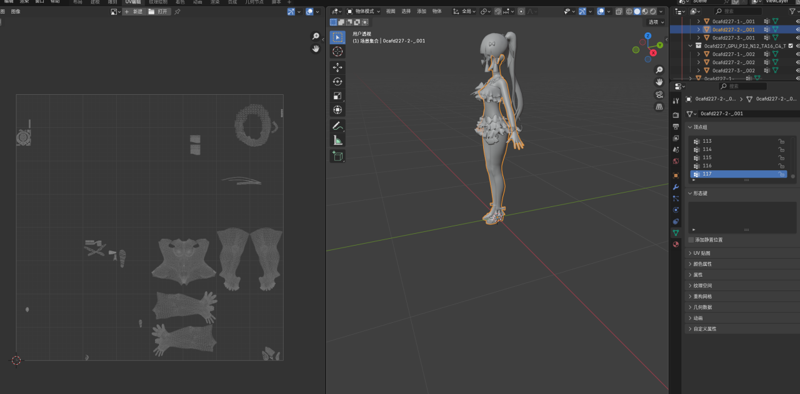

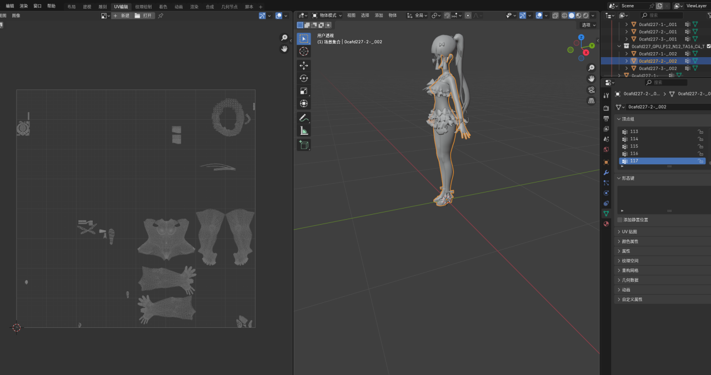

::: tip 🕵️‍♀️ 进阶检查步骤
1.  选中模型。
2.  进入右下角绿色的 **`Data`** 属性面板。
3.  找到 **`UV Maps`** 选项。
:::

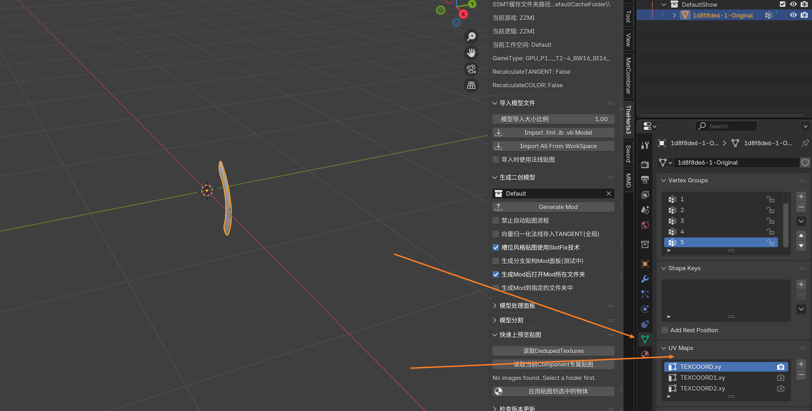

切换到其他 UV 层（如 `UVMap.001`, `UVMap.002` 等），逐个对比不同数据类型的表现，最终筛选出 **完全正确** 的那个：

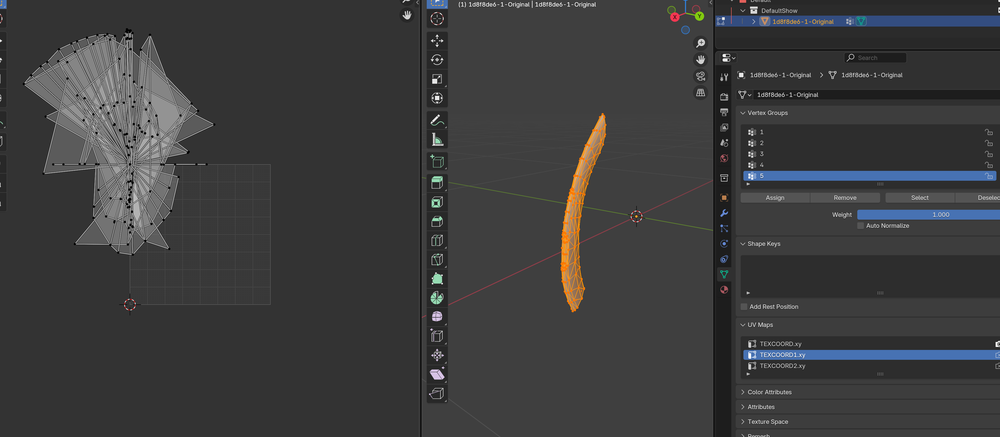

::: info 📝 总结
实战中 **不能仅依赖第一套 UV**，必须 **全面检查所有 UV 层**。
注重细节，才能制作出高质量的 Mod！ 🚀
:::