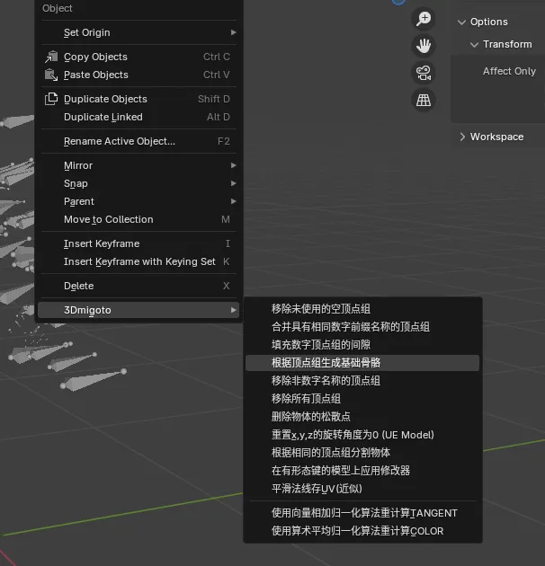

# ❓ 常见问题解答 (FAQ)

## 🖥️ 界面问题

### Q: 为什么工具界面和 BiliBili 视频里的不一样？

**A:** 因为工具一直在更新新版本，目前逆向工具和 Mod 制作工具已经拆开了。

新版本工具，经过不断的技术积累和细节打磨，功能上一定是强于旧版本的，只是界面发生了变更，实际上用法相差不大，不用担心。

## 🔄 Mod 制作与还原

### Q: 我想把 Mod 中逆向出来的模型重新生成为 Mod 怎么做？

**A:** 使用 **SSMT** 和 **SSMT 的 Blender 插件** 来进行 Mod 制作，是最方便的。

其次也可以使用老外的工具，例如 `gui_collect` 和 `XXMI-Tools`, `WWMI-Tools`。

> 💡 **概念区分**：Mod 逆向只是拿到了模型，拿到了模型剩下的你想干嘛都不是你说了算嘛，要区分这个概念，拿到了模型剩下的步骤就和 Mod 逆向无关了，要生成 Mod 就是 Mod 制作的部分。
>
> 实际上，逆向工具只是为了获取 Mod 中包含的模型，获取到模型之后，剩余的流程就和 `3Dmigoto-Sword-Lv6` 的关系不大了，主要是 Mod 制作流程。

### Q: 那么如何把模型制作为 Mod 呢？

-   **米家游戏**：可以使用 `gui_collect` 或 `GIMI`，`SRMI`，`HIMI`，`ZZMI` 等仓库的模型收集脚本来提取模型，然后用 `XXMI-Tools` 导入模型后生成 Mod，也可以使用 **SSMT** 提取模型，然后用 **SSMT 的 Blender 插件** 生成 Mod。
-   **鸣潮**：可以用 `WWMI-Tools` 来制作 Mod，也可以用 **SSMT** 来制作 Mod。

> 💡 **工具推荐**：对于工具的选择我的推荐是哪个好用用哪个，没必要绑定死在一个工具上，因为开发者不同所以每个工具都有其特色和优缺点。
>
> -   在鸣潮 Mod 制作方面 `WWMI-Tools` 的优势更大，次选 SSMT 流程。
> -   在米家游戏制作上面 SSMT 流程做的也不错，和老外的工具各有优劣。
>
> 当然最好是全部都能掌握，早日成为 Mod 大师，加油。

### 🔗 相关链接

-   **SSMT 下载地址**：[https://github.com/StarBobis/SSMT3](https://github.com/StarBobis/SSMT3)
-   **XXMITools 插件下载地址**（老外的米家游戏生成 Mod 工具）：[https://github.com/leotorrez/XXMITools](https://github.com/leotorrez/XXMITools)
-   **gui_collect**（老外的米家游戏模型提取工具）：[https://github.com/Petrascyll/gui_collect](https://github.com/Petrascyll/gui_collect)
-   **WWMI-Tools**（老外的鸣潮模型提取和 Mod 生成工具）：[https://github.com/SpectrumQT/WWMI-Tools](https://github.com/SpectrumQT/WWMI-Tools)

## 🛠️ 功能疑问

### Q: 为什么最强的功能是手动逆向？我觉得一键逆向更方便

**A:** 因为部分 Mod 加了复杂的 `ini` 写法和混淆机制，一键逆向并不能保证所有稀奇古怪的格式都能解析出来。

尽管长达 2.5 年的更新期间已经完善了大多数 Mod 格式以及混淆格式 `ini` 的解析，但是 Mod 格式这个东西本身就是日新月异的。

一键逆向只能解决 99% 的 Mod 逆向问题，剩下的 1% 就得用我们的 **手动逆向** 功能了。

目前一键逆向仍在持续更新中，结合手动逆向可解决所有 Mod 逆向问题。

## 🦴 骨骼绑定

### Q: 逆向出来的模型如何绑定骨骼？

**A:** GI 的逆向配合骨骼用起来更方便哦，每个游戏都可以配合游戏原生骨骼。

实现逆向出来模型后一键绑骨的操作，因为逆向出的模型是有顶点组的，做到了轻松使用其它人的 Mod 中的模型进行二次创作：

-   **骨骼下载**：[https://github.com/zeroruka/GI-Bones](https://github.com/zeroruka/GI-Bones) （部分旧版本骨骼地址）
-   **案例演示**：
    -   [视频演示 1](https://www.bilibili.com/video/BV1oi421h7mz/?spm_id_from=333.999.0.0)
    -   [视频演示 2](https://www.bilibili.com/video/BV1St5VzrE16/?spm_id_from=333.1387.homepage.video_card.click)

当然你也可以自己创建骨骼，SSMT 的 Blender 插件有个方便的功能可以初始化骨骼：

## 🔒 激活与安全

### Q: 机器码锁了之后是不是只要不换主板就没事？

**A:** 是。

### Q: 老版本激活逆向插件 新版本是不是还得激活啊？

**A:** 不需要，新版本都附带旧的激活，从旧版本更新到新版本只需要下载最新版即可。

