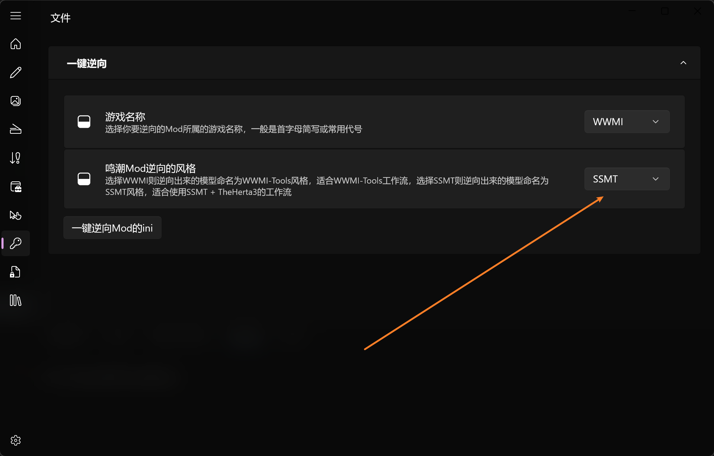
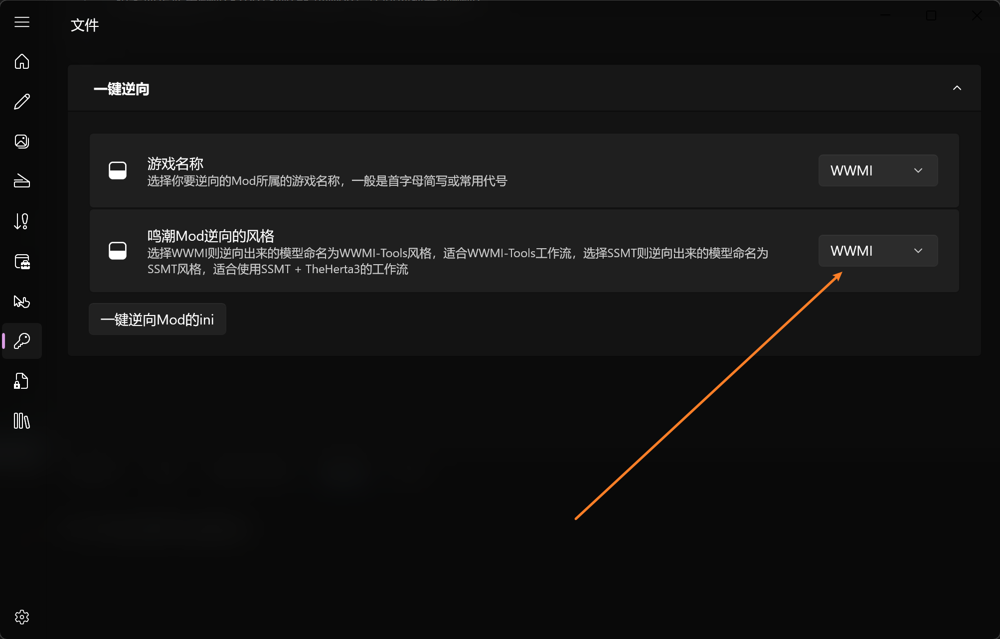
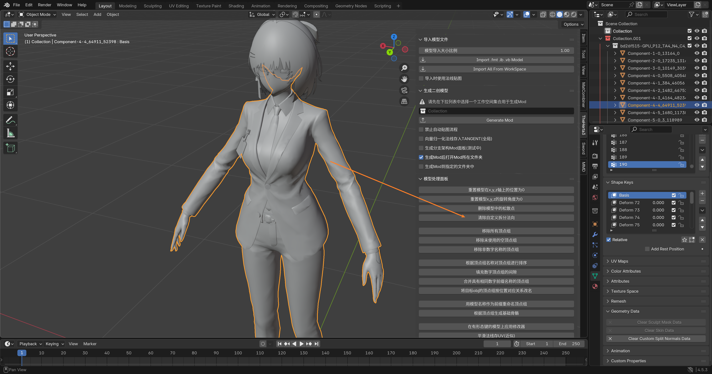

# 鸣潮Mod一键逆向的注意事项

## SSMT + TheHerta3流程选择正确的逆向风格
如果你是使用SSMT + TheHerta3 制作鸣潮Mod，逆向选项要选SSMT：

## WWMI-Tools流程选择正确的逆向风格
如果你是使用WWMI-Tools制作鸣潮Mod，逆向选项要选WWMI：

不管使用哪个风格，逆向出来的Mod都必须通过TheHerta3的一键导入来进行导入，否则可能会有其它问题

然后就是TheHerta3虽然写着支持版本为最低4.5LTS，但是其实3.6LTS也是能用的，所以和WWMI-Tools的制作流程是不冲突的，你只用TheHerta3导入逆向出来的模型即可，剩余制作用不到TheHerta3

逆向完成后，大部分鸣潮Mod都没问题，但是小部分鸣潮Mod会出现法线不正确的问题，此时可以点击`清除自定义拆分法向`来试试能不能恢复正常：

 

