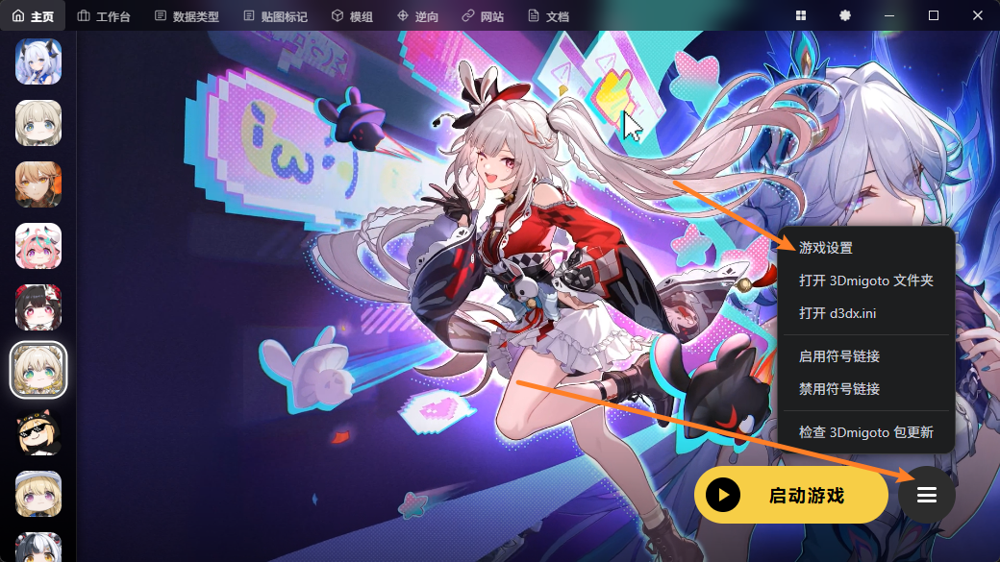
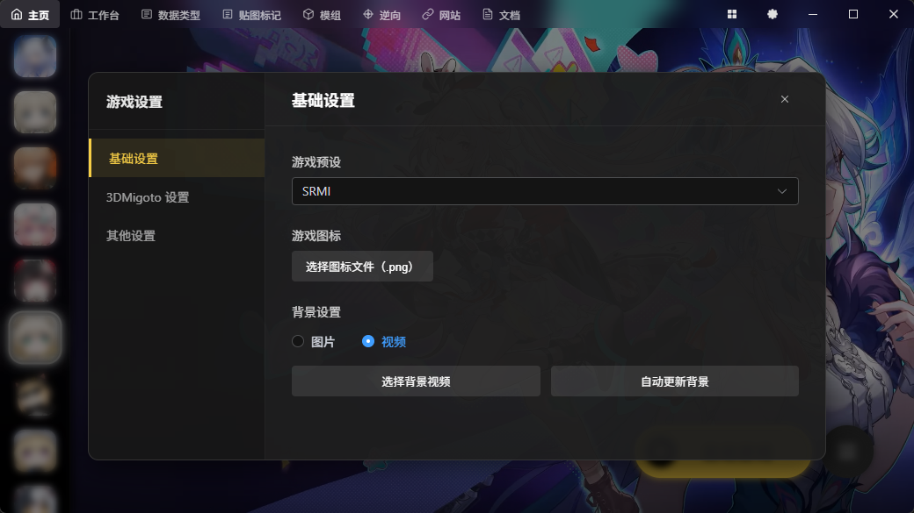
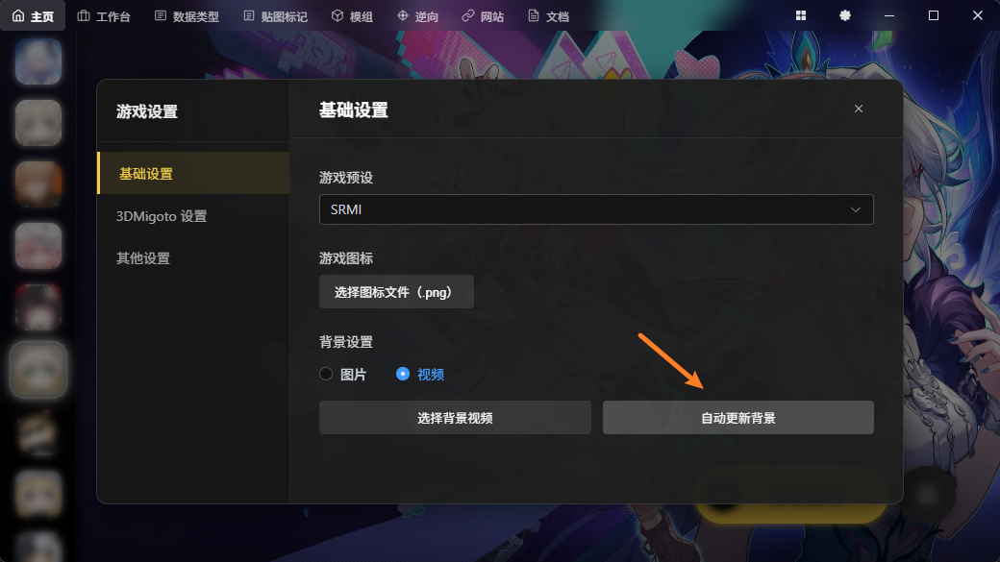
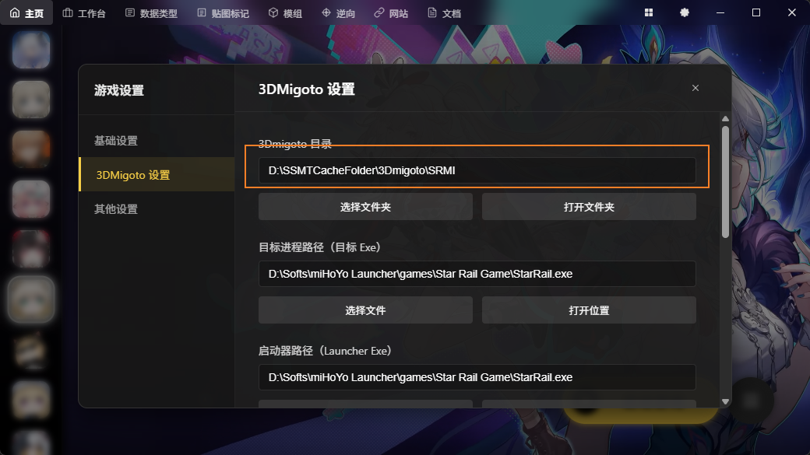
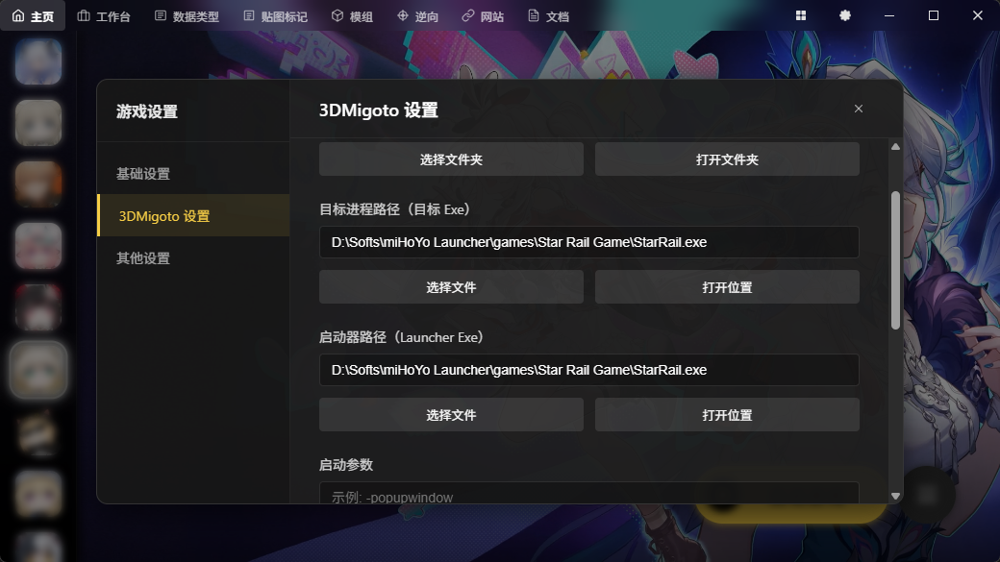
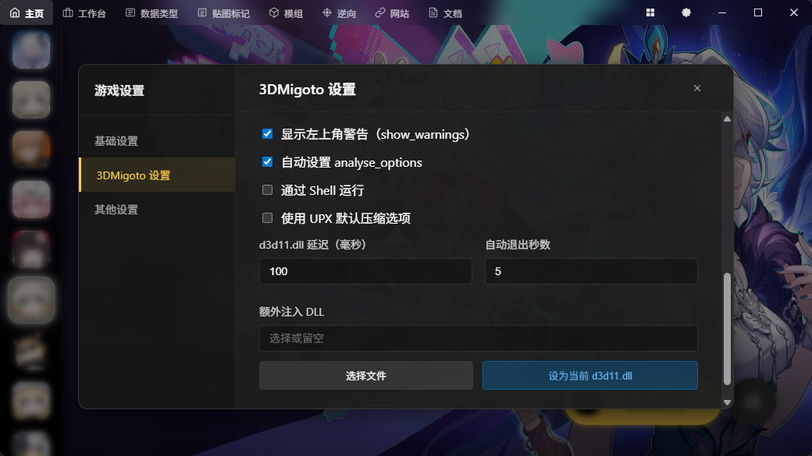
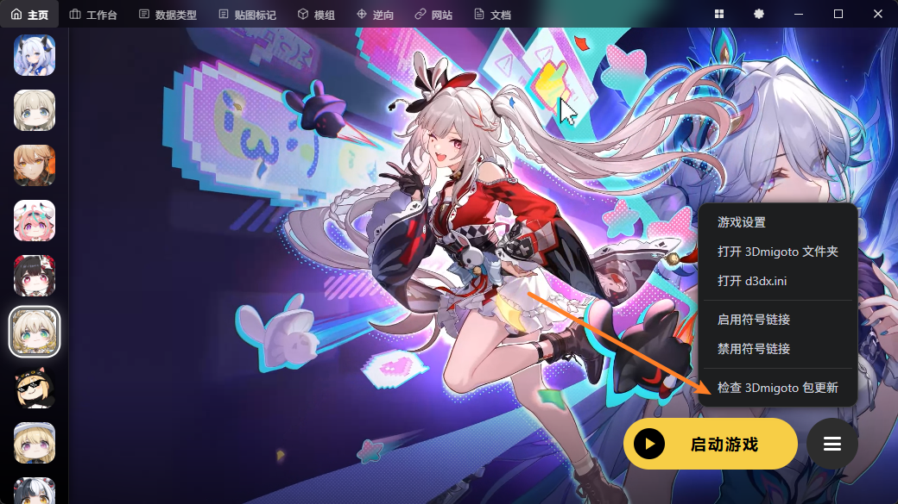

# 开始游戏前的配置
第一次使用SSMT时，需要进行一系列配置

鼠标移动到右侧三个横线的区域，会弹出菜单项：

我们点击游戏设置，打开设置卡片：

此时首先设置游戏预设，这里崩铁就选SRMI，其它游戏就选各自对应的MI即可

随后可以指定图标，以及指定背景图

对于GIMI、SRMI、HIMI、ZZMI等游戏预设，是支持全自动更新背景图为官方背景图的：

随后我们切换到3Dmigoto设置，先设置一下3Dmigoto的目录：

这里注意，如果你喜欢使用XXMI Launcher，你可以把这里的3Dmigoto目录选择到XXMI Launcher对应游戏的3Dmigoto目录下面

SSMT的配置项非常灵活，可以配合任意第三方启动器/管理器一起使用

目标进程路径就是游戏的进程的完整路径也就是要注入3Dmigoto的进程，启动器路径指的是点击开始游戏后要调起的程序

其它设置如有需要自行设置即可

配置完成后，点击 开始游戏 就可以启动3Dmigoto并开始游戏了。

注意如果你是第一次配置对应的游戏，且3Dmigoto目录下不存在对应的d3dx.ini及其相关文件，则点击开始游戏后会根据游戏预设，自动从Github下载对应游戏预设的3Dmigoto包，例如GIMI下载的就是GIMI-Package

后续如果需要更新3Dmigoto包，点击三条横线最下方的菜单项即可：

